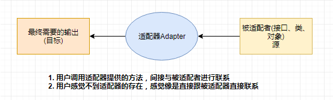
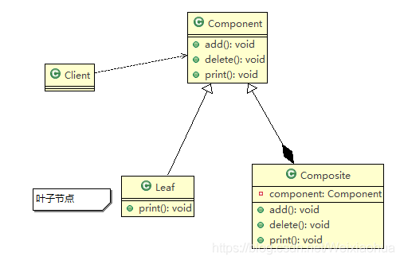

## GoF 23


- [x] 一种思维，一种态度，一种进步

- 创建型模式：
	- 单例模型，工厂模式，抽象工厂模式，建造者模式，原型模式。

- 结构型模式:
	- 适配器模式，桥接模式，装饰模式，组合模式，外观模式，享元模式，代理模式。

- 行为型模式:
	- 模板方法模式，命令模式，迭代器模式，观察者模式，中介者模式，备忘录模式，解释器模式，状态模式，策略模式，职责链模式，访问者模式。


OOP七大原则

- /**开闭原则**/：对拓展开发，对修改关闭
- /**里氏替换原则**/：继承必须确保超类所拥有的性质在子类中仍然成立。尽量减少修改父类拥有的属性，正方形不是长方形。
- /**依赖倒置原则**/：要面向接口编程，不要面向实现编程。抽象不依赖细节，细节依赖抽象，降低程序的耦合性。
- /**单一职责原则**/：控制类的粒度大小，将对象解耦，提高其内聚性。保证一个方法只做一件事。
- /**接口隔离原则**/：要为各个类建立它们需要的专用接口。
- /**迪米特法则**/：只与你的直接朋友交谈，不和"陌生人"说话。降低类之间的耦合性，提高类的独立性。controller -> service -> dao
- /**合成复用原则**/：尽量先使用组合或者聚合等关联关系来实现，其次才考虑使用继承关系来实现。

## 创建型模式

### singleton 单例模式

定义：确保一个类只有一个实例，并且自行实例化并向整个系统提供这个实例化。


饿汉式


### factory 工厂模式

实现了创建者和调用者的分离

详细分类
- 简单工厂模式：用来生产同一等级结构的任意产品，新增产品，需要覆盖已有代码。
  

- 工厂方法模式：用来生产同一等级结构中的固定产品，支持增加任意产品。

  

- 抽象工厂模式：围绕一个超级工厂创建其他工厂，该超级工厂又称为其他工厂的工厂。
抽象工厂模式提供了一个创建一系列相关或者相互依赖对象的接口，无需指定它们具体的类。

- 使用场景：
	- 客户端不依赖与产品类实例如何被创建，实现等细节。
	- 强调一系列相关的产品对象一起使用创建对象需要大量重复代码。
	- 提供一个产品类的库，所有产品以同样的接口出现，从而使得客户端不依赖具体的实现。


- 优点：
	- 具体产品在应用层的代码隔离，无需关心创建的细节。
	- 将一个系列的产品统一到一起创建。

- 缺点：
	- 规定了所有可能被创建的产品集合，拓展新的产品困难。
	- 增加了系统的抽象性和理解难度。


核心本质:

- 实例化多谢不使用new，用工厂方法代替。
- 将选择实现类，创建对象统一管理和控制，从而将调用者跟我们的实现类解耦。


#### 工厂方法模式

##### 1.  定义

定义一个创建对象的抽象方法/接口，`让子类决定实例化哪一类`，工厂方法使一个类的`实例化延迟到子类`

##### 2. 通用类图与通用源码

- 抽象工厂类：抽象工厂类是工厂方法模式的核心，与调用者直接交互用来提供产品，可以是接口，也可以是抽象类；

- 具体工厂实现：工厂实现是具体的实例化对象的类，如果需要扩展新的产品种类，就增加多一个工厂的实现即可；

- 抽象产品类：产品接口的主要目的是定义产品的规范，所有的产品实现都必须遵循产品接口定义的规范。产品接口是调用者最为关心的，产品接口定义的优劣直接决定了调用者代码的稳定性。同样，产品接口也可以用抽

  象类来代替，但要注意最好不要违反里氏替换原则；

- 具体产品类：实现产品接口的具体类，决定了产品在客户端中的具体行为；


### builder 建造者模式

建造者模式也属于创建型模式，它提供了一种创建对象的最佳方式。

定义：将一个复杂对象的构建与它的表示分离，使得同样的构建过程可以创建不同的表示

在用户不知道对象的建造过程和细节的情况下就可以之间创建复杂的对象。

用户只需要给出指定复杂对象的类型和内容，建造者模式负责按顺序创建负责对象。


### prototype 原型模式

https://blog.csdn.net/Weixiaohuai/article/details/102880264?ops_request_misc=%257B%2522request%255Fid%2522%253A%2522165133281216780366518233%2522%252C%2522scm%2522%253A%252220140713.130102334.pc%255Fblog.%2522%257D&request_id=165133281216780366518233&biz_id=0&utm_medium=distribute.pc_search_result.none-task-blog-2~blog~first_rank_ecpm_v1~rank_v31_ecpm-20-102880264.article_score_rank_blog&utm_term=%E8%AE%BE%E8%AE%A1%E6%A8%A1%E5%BC%8F&spm=1018.2226.3001.4450

- 思想：**Java中Object类是所有类的根类，Object类提供了一个clone()方法，该方法可以 将一个Java对象复制一份，但是需要实现clone的Java类必须要实现一个接口Cloneable， 该接口表示该类能够复制且具有复制的能力 => 原型模式**

- 克隆

原型模式是一种创建型设计模式，Prototype模式允许一个对象再创建另外一个可定制的对象，根本无需知道任何如何创建的细节。

工作原理是:通过将一个原型对象传给那个要发动创建的对象，这个要发动创建的对象通过请求原型对象拷贝它们自己来实施创建   

形象的理解：孙大圣拔出猴毛， 变出其它孙大圣      

                                                   

创建一些对象更高效。

#### 浅拷贝和深拷贝

浅拷贝

1. 对于数据类型是基本数据类型的成员变量，浅拷贝会直接进行值传递，也就是将 该属性值复制一份给新的对象。 
2.  对于数据类型是引用数据类型的成员变量，比如说成员变量是某个数组、某个类 的对象等，那么浅拷贝会进行引用传递，也就是只是将该成员变量的引用值（内存地址）复制一份给新的对象。因为实际上两个对象的该成员变量都指向同一个 实例。在这种情况下，在一个对象中修改该成员变量会影响到另一个对象的该成 员变量值 
3. 浅拷贝是使用默认的 clone()方法来实现 sheep = (Sheep) super.clone(); 

深拷贝

1. 复制对象的所有基本数据类型的成员变量值 
2. 为所有引用数据类型的成员变量申请存储空间，并复制每个引用数据类型成员变量所引用的对象，直到该对象可达的所有对象。也就是说，对象进行深拷贝要对 整个对象进行拷贝
3. 深拷贝实现方式1：重写clone方法来实现深拷贝
4. 深拷贝实现方式2：通过对象序列化实现深拷贝(推荐）


(二)、序列化方式

简单的讲就是序列化就将对象写到流的一个过程，写到流里面去（就是字节流）就等于复制了对象，但是原来的对象并没有动，只是复制将类型通过流的方式进行读取，然后写到另一块内存地址中。

```java
import java.io.*;
 
/**
 * @Description:
 * @author: weishihuai
 * @Date: 2019/10/22 20:11
 */
public class Student implements Serializable {
    private double weight;
    private Integer pkid;
    private String name;
    private Teacher teacher;
 
    public Student deepCloneBySerializable() {
        Student student = null;
        ByteArrayOutputStream byteArrayOutputStream = null;
        ObjectOutputStream objectOutputStream = null;
        ByteArrayInputStream byteArrayInputStream = null;
        ObjectInputStream objectInputStream = null;
        try {
            byteArrayOutputStream = new ByteArrayOutputStream();
            objectOutputStream = new ObjectOutputStream(byteArrayOutputStream);
            objectOutputStream.writeObject(this);
 
            byteArrayInputStream = new ByteArrayInputStream(byteArrayOutputStream.toByteArray());
            objectInputStream = new ObjectInputStream(byteArrayInputStream);
            student = (Student) objectInputStream.readObject();
            return student;
        } catch (IOException | ClassNotFoundException e) {
            e.printStackTrace();
        } finally {
            if (null != objectInputStream) {
                try {
                    objectInputStream.close();
                } catch (IOException e) {
                    e.printStackTrace();
                }
            }
            if (null != byteArrayInputStream) {
                try {
                    byteArrayInputStream.close();
                } catch (IOException e) {
                    e.printStackTrace();
                }
            }
            if (null != objectOutputStream) {
                try {
                    objectOutputStream.close();
                } catch (IOException e) {
                    e.printStackTrace();
                }
            }
            if (null != byteArrayOutputStream) {
                try {
                    byteArrayOutputStream.close();
                } catch (IOException e) {
                    e.printStackTrace();
                }
            }
        }
        return student;
    }
}
```


```java
public class Product implements Cloneable {

    private String name;
    private Date create;

    @Override
    protected Object clone() throws CloneNotSupportedException {
       otected Object clone() throws CloneNotSupportedException {
        Video clone = (Video) super.clone();

        Date date = new Date();
        clone.setCreate(date);

        return clone;
    }

    public Product(String name, Date create) {
        this.name = name;
        this.create = create;
    }

    public Product() {
    }

    @Override
    public String toString() {
        return "Video{" +
                "name='" + name + '\'' +
                ", create=" + create +
                '}';
    }

    public String getName() {
        return name;
    }

    public void setName(String name) {
        this.name = name;
    }

    public Date getCreate() {
        return create;
    }

    public void setCreate(Date create) {
        this.create = create;
    }
}

```

## 结构型模式

- 从程序的结构上实现松耦合，从而可以扩大整体的类结构，用来解决更大的问题。

### adapter 适配器模式

- 对象适配器优点 （组合，常用）
	- 一个对象适配器可以把多个不同的适配者适配到同一个目标
	- 可以适配一个适配者的子类，由于适配器和适配者之间是关联关系，适配者的子类也可通过该适配器进行适配。
	
- 类适配器 （单继承）
	- 对于java，C#等不支持多重类继承的语言，一次最多只能适配一个适配者类，不能同时适配多个适配者。

- 适用场景
	- 系统需要使用一些现有的类，而这些类的接口不符合系统的需要，甚至没有类的源代码。
	- 想创建一个可以重复使用的类，用于与一些彼此之间没有太大关联的一些类，包括一些可能在将来引进的类一起工作。


### bridge 桥接模式

- 桥接模式是将抽象部分和它的实现部分分离，使它们都可以独立地变化。它是一种对象结构型模式。


分析这个场景中有两变化的维度：品牌，类型。


好处分析：
- 桥接模式类似于多继承方案，但是多继承方案又违背了类的单一职责原则，复用性比较差，类的个数比较多，桥接模式是比多继承方案更好的解决方案。极大的减少了子类的个数。

-  桥接模式提高了系统的可扩充性，在两个变化维度中任意拓展一个维度，都不需要修改原来的系统。符合开闭原则，就像一座桥，可以把两个变化的维度连接起来。

劣势分析：
- 桥接模式的引入会增加系统的理解和设计难度，由于聚合关联关系建立在抽象层，要求开发者针对抽象进行设计和编程。
- 桥接模式要求正确识别出系统中两个独立变化的维度，因此其使用范围具有一定的局限性。 

最佳实践：
- 如果一个系统需要在构建的抽象化角色和具体化角色之间增加更多的灵活性，避免在两个层次之间建立静态的继承联系，通过桥接模式可以使它们在抽象层建立一个关联关系。
- 抽象化角色和实现化角色可以以继承的方式独立扩展而互不影响，在程序运行时可以动态将一个抽象化子类的对象和一个实现化子类进行组合，即系统需要对抽象化角色和实现化角色进行动态耦合。
- 一个类存在两个独立变化的维度，且这个两个维度都需要进行扩展。
- 虽然在系统中使用继承是没有问题的，但是由于抽象化角色和具体化角色需要独立变化，设计要求需要独立管理这两者。对于那些不希望使用继承或者因为多层次继承导致整个系统类的个数剧增的系统，桥接模式更为适用。

场景：
- java语言通过java虚拟机实现了平台无关性。
 
- jdbc驱动程序也是桥接模式的应用之一。

### proxy 代理模式

代理模式：SpringAOP和SpringMVC的底层。

代理模式的分类：
- 静态代理
- 动态代理

角色分析：
- 抽象角色：一般会使用接口或者抽象类来解决
- 真实角色：被代理的角色
- 代理角色：代理真实角色，代理真实角色后，我们一般会做一些附属操作
- 客户：访问代理对象的人


代理模式是不会将真是对象通过参数传递进去，而是直接在代理类中创建实例对象
适配器的适配对象与适配器没有实现同一个接口，而代理者与被代理者实现了同一个接口


代码步骤：
1.接口

```java
//租房
public interface Rent {
    void rent();
}
```
2.真实角色
```java
//房东
public class Host implements Rent{
    @Override
    public void rent() {
        System.out.println("房东把房子出租");
    }
}
```

3.代理角色
```java
public class Proxy implements Rent{
    private Host host;

    public Proxy(Host host) {
        this.host = host;
    }

    @Override
    public void rent() {
        seeHouse();
        hetong();
        host.rent();
        fee();
    }

    //看房
    public void seeHouse() {
        System.out.println("中介带客户看房");
    }

    //合同
    public void hetong() {
        System.out.println("中介和客户签合同");
    }

    //收中介费
    public void fee() {
        System.out.println("收中介费");
    }
}

```

4.客户端访问代理角色
```java
public class Proxy implements Rent{
    private Host host;

    public Proxy(Host host) {
        this.host = host;
    }

    @Override
    public void rent() {
        seeHouse();
        hetong();
        host.rent();
        fee();
    }

    //看房
    public void seeHouse() {
        System.out.println("中介带客户看房");
    }

    //合同
    public void hetong() {
        System.out.println("中介和客户签合同");
    }

    //收中介费
    public void fee() {
        System.out.println("收中介费");
    }
}

```

代理模式的好处：
- 可以使真实角色的操作更加纯粹，，不用去关注一些公共业务。
- 公共也就交给了代理角色。实现了业务的分工。
- 公共业务发生扩展的时候，方便集中管理。

缺点：
- 一个真实角色就会产生一个代理角色；代码量会翻倍，开发效率会变低。


加深理解：


### 动态代理

- 动态代理和静态代理角色一样
- 动态代理的代理类是动态生成的，不是我们直接写好的。
- 动态代理分为两大类：1. 基于接口的动态代理，2. 基于类的动态代理
  - 基于接口---JDK动态代理 【我们在这里使用】
  - 基于类：cglib
  - java字节码实现：javassist

需要了解两个类：：Proxy : 代理，InvocationHandler（接口）：调用处理程序

动态代理的好处：

- 可以使真实角色的操作更加纯粹，不用去关注一些公共的业务
- 公共也就交给了代理角色，实现了业务的分工
- 公共业务发生扩展的时候，方便集中管理
- 一个动态代理类代理的是一个接口，一般就是对应的一类业务

### Facade 外观模型

**隐藏系统的复杂性，并向客户端提供了一个可以访问系统的接口。**

  电源总开关是四盏灯、一个风扇、一台空调和一台电视机的外观。有了外观以后，启动和关闭这些电器设备都简化了。 

  直接 new 一个总开关。 

  在 new 总开关的同时把灯、风扇、空调和电视机都初始化好并且接好线。 

  对外暴露方法（打开总开关，关闭总开关）。 

  打开总开关（按一下开关键）：打开灯、风扇、空调和电视机  

  关闭总开关（按一下开关键）：关闭灯、风扇、空调和电视机  

## 行为型模式

### 备忘录模式

某系统提供了用户信息操作模块，用户可以修改自己的各项信息。

为了使操作过程更加人性化，可以使用备忘录模式对系统进行改进，

==使得用户在进行了错误操作之后可以恢复到操作之前的状态==

### 责任链模式

责任链模式是一种设计模式。

**定义**
 	使多个对象都有机会处理请求，从而避免请求的发送者和接受者之间的耦合关系。将这些对象连成一条链，并沿着这条链传递请求，直到有一个对象处理它为止。

在责任链模式里，很多对象由每一个对象对其下家的引用而连接起来形成一条链。

请求在这个链上传递，直到链上的某一个对象决定处理此请求。

发出这个请求的客户端并不知道链上的哪一个对象最终处理这个请求，

这使得系统可以在不影响客户端的情况下动态地重新组织和分配责任。  

 

## 工厂方法模式

### 定义

**定义一个创建对象的抽象方法/接口，让子类决定实例化哪一个类，工厂方法使一个类的实例化延迟到其子类。**

### 通用类图与通用源码

工厂方法模式主要有四个要素：

- 抽象工厂类：抽象工厂类是工厂方法模式的核心，与调用者直接交互用来提供产品，可以是接口，也可以是抽象类；

- 具体工厂实现：工厂实现是具体的实例化对象的类，如果需要扩展新的产品种类，就增加多一个工厂的实现即可；

- 抽象产品类：产品接口的主要目的是定义产品的规范，所有的产品实现都必须遵循产品接口定义的规范。产品接口是调用者最为关心的，产品接口定义的优劣直接决定了调用者代码的稳定性。同样，产品接口也可以用抽象类来代替，但要注意最好不要违反里氏替换原则；

- 具体产品类：实现产品接口的具体类，决定了产品在客户端中的具体行为；

  

  

  在工厂方法模式中，抽象产品类AbstractProduct负责定义产品的共性，实现对事物最抽象的定义 ；AbstractCreatorFactory是抽象工厂，具体如何创建产品类是由具体的实现工厂ConcreteCreatorFactory来完成的。下面我们一起看一个比较实用的通用源码。

抽象产品类AbstractProduct ：

```java
public abstract class AbstractProduct {
    public void get() {
        System.out.println("抽象产品类的公共方法");
    }
 
    //抽象方法
    public abstract void execute();
}
```

具体的产品类可以有多个，都继承于抽象产品类。

```java
public class ConcreteProduct01 extends AbstractProduct {
    @Override
    public void execute() {
        System.out.println("ConcreteProduct01#execute()");
    }
}
 
 
public class ConcreteProduct02 extends AbstractProduct {
    @Override
    public void execute() {
        System.out.println("ConcreteProduct02#execute()");
    }
}
```

 抽象工厂类负责定义产品对象的产生，其代码如下：

```java
/**
 * 抽象工厂类
 */
public abstract class AbstractCreatorFactory {
    /**
     * 创建一个产品对象
     *
     * @param tClass
     * @param <T>
     * @return
     */
    public abstract <T extends AbstractProduct> T createProduct(Class<T> tClass);
 
}
```

具体如何产生一个对象，是由具体的工厂实现类来完成的，其代码如下：

```java
/**
 * 具体工厂类
 */
public class ConcreteCreatorFactory extends AbstractCreatorFactory {
    @Override
    public <T extends AbstractProduct> T createProduct(Class<T> tClass) {
        AbstractProduct product = null;
        try {
            product = (AbstractProduct) Class.forName(tClass.getName()).newInstance();
        } catch (Exception e) {
            e.printStackTrace();
        }
        return (T) product;
    }
}
```

客户端调用类：

```java
public class Client {
    public static void main(String[] args) {
        AbstractCreatorFactory creatorFactory = new ConcreteCreatorFactory();
        ConcreteProduct01 product = creatorFactory.createProduct(ConcreteProduct01.class);
        product.execute();
        System.out.println("========================");
        ConcreteProduct02 product2 = creatorFactory.createProduct(ConcreteProduct02.class);
        product2.execute();
    }
}
```

该通用代码是一个比较实用的、易扩展的框架，读者可以根据实际项目的需要进行扩展。

### 工厂方法模式的应用

下面我们模拟工厂生成鼠标的过程，来说明工厂方法模式在项目中是如何应用的。

相关类图如下：


相关代码实现如下：

抽象产品类：

```java
/**
 * 抽象产品类：鼠标
 */
public abstract class Mouse {
    public abstract void click();
}
```

具体产品类：

```java
/**
 * 具体产品类：戴尔鼠标
 */
public class DellMouse extends Mouse {
    @Override
    public void click() {
        System.out.println("戴尔鼠标点击...");
    }
}
```

抽象工厂类：

```java
/**
 * 抽象工厂类：鼠标工厂
 */
public abstract class AbstractMouseFactory {
    /**
     * 创建鼠标的方法
     */
    public abstract Mouse createMouse();
}
```

具体工厂类：

```java
/**
 * 具体工厂类：戴尔鼠标具体工厂
 */
public class DellMouseFactory extends AbstractMouseFactory {
    @Override
    public Mouse createMouse() {
        //创建一个戴尔鼠标
        return new DellMouse();
    }
}
```

场景类：

```java
/**
 * 场景类
 */
public class Client {
    public static void main(String[] args) {
        AbstractMouseFactory mouseFactory = new DellMouseFactory();
        Mouse mouse = mouseFactory.createMouse();
        mouse.click();
    }
}
```

上述的代码实现比较简单，当然扩展性也很强，假设我们需要新增一个生产惠普鼠标的功能，那么此时我们只需要新建一个惠普鼠标的具体产品类、新建一个生产惠普鼠标的具体工厂类就可以完成这些变更，实现代码如下：

```java
/**
 * 具体产品类：惠普鼠标
 */
public class HpMouse extends Mouse {
    @Override
    public void click() {
        System.out.println("惠普鼠标点击...");
    }
}
```

```java
/**
 * 具体工厂类：惠普鼠标具体工厂
 */
public class HpMouseFactory extends AbstractMouseFactory {
    @Override
    public Mouse createMouse() {
        //创建一个惠普鼠标
        return new HpMouse();
    }
}
```

扩展后的相关类图如下：


此时，场景类需要生产惠普鼠标的时候直接调用上述工厂类即可，可以看到工厂方法模式的扩展性还是很友好的。

### 工厂方法模式的扩展

工厂方法模式有很多扩展，而且与其他模式结合使用威力更大，下面将介绍几种扩展。

#### 1. 缩小为简单工厂模式

我们考虑这样一个问题：一个模块仅需要一个工厂类，没有必要把它产生出来，使用静态的方法就可以了，根据这一要求，我们把上面的例子稍微修改一下，类图如下：


可以看到，我们去掉了AbstractMouseFactory抽象类，同时把创建鼠标的方法设置为静态类型，简化了类的创建过程。

简单工厂类：

```java
/**
 * 简单工厂类
 */
public class MouseFactory {
 
    public static <T extends Mouse> T createMouse(Class<T> tClass) {
        Mouse mouse = null;
        try {
            mouse = (Mouse) Class.forName(tClass.getName()).newInstance();
        } catch (Exception e) {
            e.printStackTrace();
        }
        return (T) mouse;
    }
 
}
```

场景类：

```java
/**
 * 场景类
 */
public class Client {
    public static void main(String[] args) {
        DellMouse dellMouse = MouseFactory.createMouse(DellMouse.class);
        dellMouse.click();
        System.out.println("=================");
        HpMouse hpMouse = MouseFactory.createMouse(HpMouse.class);
        hpMouse.click();
    }
}
```

运行结果没有发生变化，但是我们的类图变简单了，而且调用者也比较简单，该模式是工厂方法模式的弱化，因为简单，所以叫简单工厂模式，也叫作静态工厂模式。在实际项目中，采用这种方式的案例还是比较多的，其缺点是工厂类的扩展比较困难，不符合开闭原则，但它仍然是一个非常实用的设计模式。

#### 2. 替换单例模式

单例模式的核心要求就是在内存中只有一个对象，通过工厂方法模式也可以只在内存中生产一个对象。下面我们看一下怎么实现：

```java
public class Singleton {
    private Singleton() {
    }
 
    public void doSomething() {
 
    }
 
}
```

```java
public class SingletonFactory {
    private static Singleton singleton;
 
    static {
        try {
            Class clazz = Class.forName(Singleton.class.getName());
            //获取无参构造方法
            Constructor constructor = clazz.getDeclaredConstructor();
            //设置无参构造方法是可以访问的
            constructor.setAccessible(true);
            singleton = (Singleton) constructor.newInstance();
        } catch (Exception e) {
            e.printStackTrace();
        }
    }
 
    public static Singleton getSingleton() {
        return singleton;
    }
 
}
```

### 总结

工厂方法模式的优点：

1、良好的封装性，代码结构清晰。如一个调用者需要一个具体的产品对象，只要知道产品类的类名、或约束字符串就可以了，不用知道创建对象的过程，降低模块间的耦合；

2、工厂方法模式的扩展性十分优秀，在增加产品类的情况下，只需要适当地修噶爱啊具体的工厂类或扩展一个工厂类，就可以完成变更。

3、屏蔽产品类。产品类的实现如何变化，调用者都不需要关心，它只关心产品的接口，只要接口保持不变，系统中的上层模块就不用发生变化。

4、工厂方法模式是典型的解耦框架。高层模块只需要知道产品的抽象类，其他的实现类都不用关系，符合迪米特法则，我不需要就不要去交流；也符合依赖倒置原则，只依赖产品类的抽象；当然也符合里氏替换原则，使用产品类的子类去替换父类，没问题。

工厂方法模式的缺点：

如果产品的生产过程并不复杂，假如直接通过new Object()就能实例化对象的，那么就无须使用工厂方法，反而让系统多了一些工厂方法接口和实现，不方便管理，可维护性差。

## 抽象工厂模式

### 简介

`为创建一组相关或相互依赖的对象提供一个接口，而且无需指定他们的具体类。`

上面的文字说明，并不是很好理解，所以举个简单的例子：

`如海尔电器工厂生产的海尔电视机、海尔电冰箱，海尔电视机位于电视机产品等级结构中，海尔电冰箱位于电冰箱产品等级结构中，海尔电视机、海尔电冰箱构成了一个产品族。我们将生产海尔电视机、海尔电冰箱(位于不同等级结构中的产品)的工厂就叫做抽象工厂。`

### 与工厂方法区别

- 抽象工厂模式：用来创建一组相关或者相互依赖的对象，针对的多个产品等级结构（如海尔电视机、海尔电冰箱等在不同的产品结构，两者构成一个产品族）；
- 工厂方法模式：针对的是一个产品等级结构（如海尔电视机、松下电视机等都在电视机产品结构）；

### 抽象工厂模型案例

下面，我们还是拿前面工厂方法模式举的例子，讲解一下如何实现抽象工厂模式。抽象工厂模式也就是不仅生产鼠标，同时生产键盘；即抽象工厂类，有生产鼠标，生产键盘两个接口。

相关类图如下：


抽象工厂模式是工厂方法的升级版本，在有多个业务品种、业务分类时，通过抽象工厂模式产生需要的对象是一种非常好的解决方式。具体实现源码如下：

抽象工厂类：**有N个产品族，在抽象工厂类中就应该有N个创建方法。**

```java
/**
 * 抽象工厂类: 生产一个产品族,不仅生产鼠标,还生产键盘
 *
 */
public abstract class AbstractPCFactory {
 
    /**
     * 生产鼠标
     */
    public abstract Mouse createMouse();
 
    /**
     * 生产键盘
     */
    public abstract Keyboard createKeyboard();
 
}
```

抽象产品类Mouse以及具体产品类：

```java
/**
 * 抽象产品类：鼠标
 */
public abstract class Mouse {
    /**
     * 点击
     */
    public abstract void click();
}
 
/**
 * 具体产品类：戴尔鼠标
 */
public class DellMouse extends Mouse {
    @Override
    public void click() {
        System.out.println("戴尔鼠标点击...");
    }
}
```

抽象产品类Keyboard以及具体产品类：

```java
/**
 * 抽象产品类：键盘
 */
public abstract class Keyboard {
 
    /**
     * 打字
     */
    public abstract void typeWrite();
 
}
 
/**
 * 具体产品类：戴尔键盘
 */
public class DellKeyboard extends Keyboard {
 
    @Override
    public void typeWrite() {
        System.out.println("戴尔键盘打字...");
    }
 
}
```

戴尔工厂：**有M个产品等级就应该有M个实现工厂类，在每个实现工厂中，实现不同产品族的生产任务。**

```java
/**
 * 具体工厂类: 戴尔工厂,分别生产戴尔鼠标、戴尔键盘
 */
public class DellPCFactory extends AbstractPCFactory {
    @Override
    public Mouse createMouse() {
        return new DellMouse();
    }
 
    @Override
    public Keyboard createKeyboard() {
        return new DellKeyboard();
    }
}
```

场景类：

```java
/**
 * 场景类
 */
public class Client {
    public static void main(String[] args) {
        AbstractPCFactory factory = new DellPCFactory();
        Keyboard keyboard = factory.createKeyboard();
        keyboard.typeWrite();
        Mouse mouse = factory.createMouse();
        mouse.click();
    }
}
```

```**在抽象工厂模式中，假设我们需要增加一个工厂：**
```

`在抽象工厂模式中，假设我们需要增加一个工厂`

假设我们增加惠普工厂，则我们需要增加惠普工厂，和戴尔工厂一样，继承抽象工厂类AbstractPCFactory；然后创建惠普鼠标，继承鼠标类；创建惠普键盘，继承键盘类即可。

相关类图如下：


具体产品类：惠普键盘：

```java
/**
 * 具体产品类：惠普键盘
 */
public class HpKeyboard extends Keyboard {
 
    @Override
    public void typeWrite() {
        System.out.println("惠普键盘打字...");
    }
 
}
```

具体产品类：惠普鼠标：

```java
/**
 * 具体产品类：惠普鼠标
 */
public class HpMouse extends Mouse {
    @Override
    public void click() {
        System.out.println("惠普鼠标点击...");
    }
}
```

具体工厂类: 惠普工厂,分别生产惠普鼠标、惠普键盘：

```java
/**
 * 具体工厂类: 惠普工厂,分别生产惠普鼠标、惠普键盘
 */
public class HpPCFactory extends AbstractPCFactory {
    @Override
    public Mouse createMouse() {
        return new HpMouse();
    }
 
    @Override
    public Keyboard createKeyboard() {
        return new HpKeyboard();
    }
}
```

场景类：

```java
/**
 * 场景类
 */
public class Client {
    public static void main(String[] args) {
        AbstractPCFactory factory = new DellPCFactory();
        Keyboard keyboard = factory.createKeyboard();
        keyboard.typeWrite();
        Mouse mouse = factory.createMouse();
        mouse.click();
        System.out.println("==========******===========");
        AbstractPCFactory hpFactory = new HpPCFactory();
        Keyboard hpKeyboard = hpFactory.createKeyboard();
        hpKeyboard.typeWrite();
        Mouse hpMouse = hpFactory.createMouse();
        hpMouse.click();
    }
}
```

`在抽象工厂模式中，假设我们需要增加一个产品：`

假设我们增加生产耳机EarPhone这个产品，则首先我们需要增加耳机这个抽象产品类，再加上戴尔耳机，惠普耳机这两个具体产品类。之后在抽象工厂类AbstractPCFactory中，增加生产耳机的接口。最后在戴尔工厂，惠普工厂这两个类中，分别实现生产戴尔耳机，惠普耳机的功能。


抽象工厂类：增加生产耳机的方法

```java
/**
 * 抽象工厂类: 生产一个产品族,不仅生产鼠标,还生产键盘
 *
 */
public abstract class AbstractPCFactory {
 
    /**
     * 生产鼠标
     */
    public abstract Mouse createMouse();
 
    /**
     * 生产键盘
     */
    public abstract Keyboard createKeyboard();
 
    /**
     * 生产耳机
     */
    public abstract Earphone createEarPhone();
 
}
```

EarPhone耳机抽象、具体产品类：

```java
/**
 * 抽象产品类：耳机
 */
public abstract class Earphone {
    /**
     * 听音乐
     */
    public abstract void listen();
}
 
/**
 * 具体产品类：戴尔耳机
 */
public class DellEarphone extends Earphone {
    @Override
    public void listen() {
        System.out.println("戴尔耳机听音乐...");
    }
}
 
/**
 * 具体产品类：惠普耳机
 */
public class HpEarphone extends Earphone {
    @Override
    public void listen() {
        System.out.println("惠普耳机听音乐...");
    }
}
```

戴尔具体工厂：增加生产耳机的方法

```java
/**
 * 具体工厂类: 戴尔工厂,分别生产戴尔鼠标、戴尔键盘
 */
public class DellPCFactory extends AbstractPCFactory {
    @Override
    public Mouse createMouse() {
        return new DellMouse();
    }
 
    @Override
    public Keyboard createKeyboard() {
        return new DellKeyboard();
    }
 
    @Override
    public Earphone createEarPhone() {
        return new DellEarphone();
    }
}
```

惠普具体工厂：增加生产耳机的方法

```java
/**
 * 具体工厂类: 惠普工厂,分别生产惠普鼠标、惠普键盘
 */
public class HpPCFactory extends AbstractPCFactory {
    @Override
    public Mouse createMouse() {
        return new HpMouse();
    }
 
    @Override
    public Keyboard createKeyboard() {
        return new HpKeyboard();
    }
 
    @Override
    public Earphone createEarPhone() {
        return new HpEarphone();
    }
}
```

场景类：

```java
/**
 * 场景类
 */
public class Client {
    public static void main(String[] args) {
        AbstractPCFactory factory = new DellPCFactory();
        Keyboard keyboard = factory.createKeyboard();
        keyboard.typeWrite();
        Mouse mouse = factory.createMouse();
        mouse.click();
        Earphone dellEarPhone = factory.createEarPhone();
        dellEarPhone.listen();
        System.out.println("==========******===========");
        AbstractPCFactory hpFactory = new HpPCFactory();
        Keyboard hpKeyboard = hpFactory.createKeyboard();
        hpKeyboard.typeWrite();
        Mouse hpMouse = hpFactory.createMouse();
        hpMouse.click();
        Earphone hpEarPhone = hpFactory.createEarPhone();
        hpEarPhone.listen();
    }
}
```

运行结果：

```java
戴尔键盘打字...
戴尔鼠标点击...
戴尔耳机听音乐...
==========******===========
惠普键盘打字...
惠普鼠标点击...
惠普耳机听音乐...
```

在场景类中，没有任何一个方法与实现类有关系，对于一个产品来说，我们只要知道它的工厂方法就可以直接产生一个产品对象，无须关心它的实现类。

### 总结

抽象工厂模式的优点：

- 封装性：每个产品的实现类不是高层模块要关心的，只关心接口，是抽象，它不关心对象时如何创建出来的，工厂类负责这些，只要知道工厂类是谁，就可以创建出一个需要的对象。

抽象工厂模式的缺点：

- 产品族扩展非常困难，如我们需要新生产一种产品，如上面示例的耳机，这涉及的修改比较多，因为需要同时修改原先的抽象工厂类、已经实现好的具体工厂类以及场景类，这严重违反了开闭原则。

## 建造者模式

### 定义

建造者模式，也叫做生成器模式，属于创建型模式，其定义为：`将一个复杂的对象的建构与他的表示分离，使得同样的构建过程可以创建不同的表示`。

简单的理解就是：建造者模式可以将部件和其组装过程分开，一步一步创建一个复杂的对象。它隐藏了复杂对象的创建过程，按照一定的顺序创建复杂对象，用户只需给出复杂对象的类型即可获取对应的实例对象，即：`用户在不知道对象的创造过程和细节的情况下可以直接创建复杂的对象`。

### 建造者模式涉及的角色

- 【a】Builder抽象建造者：规范产品的组建，一般是由子类实现。可以是接口或者抽象类，声明了产品的创建过程以及返回产品对象的方法；
- 【b】具体的建造者：实现抽象建造者对应的产品创建方法，并且返回一个组建好的对象；
- 【c】产品类：建造者需要创建的对象，通常是实现了模板方法模式，也就是有模板方法和基本方法；
- 【d】Director监工：用于创建一个使用抽象建造者的对象，主要作用：隔离`产品创建过程`和客户端，负责控制产品具体的创建过程；
- 【e】客户端：使用监工生成产品对象的类；

### 建造者模式案例

下面我们还是以模板方法模式中的案例制造汽车模型的例子来扩展一下，之前在学习模板方法模式的时候，我们制造汽车的过程写死了其制造顺序：

```java
public final void run() {
    //先发动汽车
    this.start();
    //引擎发出声音
    this.engineBoom();

    //使用钩子方法控制喇叭是否响起来
    if (isAlarm()) {
        //打喇叭
        this.alarm();
    }

    //停止汽车
    this.stop();
}
```

需求都是不断变化的，假如哪一天需要满足客户需要怎样的顺序就制造出怎样的汽车模型出来，这时候我们应该怎么实现的？

既然需要按照客户要求的顺序来制造汽车模型，那么我们是不是需要一个可以设置制造顺序的方法，答案是肯定的。

我们在抽象汽车模型增加一个List<String> sequence属性以及设置方法，在run方法里面根据具体的关键字按顺序执行。

```java
/**
 * 抽象汽车模型类
 */
public abstract class CarModel {
 
    //存放各个基本方法的执行顺序
    private List<String> sequence = new ArrayList<>();
 
    /**
     * 启动汽车
     */
    protected abstract void start();
 
    /**
     * 停止汽车
     */
    protected abstract void stop();
 
    /**
     * 打喇叭
     */
    protected abstract void alarm();
 
    /**
     * 汽车引擎发出声音
     */
    protected abstract void engineBoom();
 
    /**
     * 汽车跑出来
     */
    public final void run() {
        for (int i = 0; i < sequence.size(); i++) {
            String seq = sequence.get(i);
            if ("start".equalsIgnoreCase(seq)) {
                this.start();
            } else if ("stop".equalsIgnoreCase(seq)) {
                this.stop();
            } else if ("alarm".equalsIgnoreCase(seq)) {
                //使用钩子方法控制喇叭是否响起来
                if (isAlarm()) {
                    //打喇叭
                    this.alarm();
                }
            } else if ("engine boom".equalsIgnoreCase(seq)) {
                this.engineBoom();
            }
        }
    }
 
    //设置执行顺序
    public final void setSequence(List<String> sequence) {
        this.sequence = sequence;
    }
 
 
    /**
     * 钩子方法,默认喇叭会响
     *
     * @return
     */
    protected boolean isAlarm() {
        return true;
    }
}
```

两个实现类BenzCarModel、BmwCarModel分别实现抽象构建类CarModel：

```java
/**
 * 奔驰汽车模型
 */
public class BenzCarModel extends CarModel {
    @Override
    protected void start() {
        System.out.println("奔驰汽车启动...");
    }

    @Override
    protected void stop() {
        System.out.println("奔驰汽车停车...");
    }

    @Override
    protected void alarm() {
        System.out.println("奔驰汽车打喇叭...");
    }

    @Override
    protected void engineBoom() {
        System.out.println("奔驰汽车引擎发出声音...");
    }

}

/**
 * 宝马汽车模型
 */
public class BmwCarModel extends CarModel {
    @Override
    protected void start() {
        System.out.println("宝马汽车启动...");
    }

    @Override
    protected void stop() {
        System.out.println("宝马汽车停车...");
    }

    @Override
    protected void alarm() {
        System.out.println("宝马汽车打喇叭...");
    }

    @Override
    protected void engineBoom() {
        System.out.println("宝马汽车引擎发出声音...");
    }

}
```

两个产品类的实现类都已经实现，我们来模拟一下生产一个奔驰模型，要求跑的时候，先发动引擎，然后再挂挡启动，然后停下来，不需要喇叭。我们增加一个场景类来实现：

```java
public class Client {
    public static void main(String[] args) {
        CarModel benzCarModel = new BenzCarModel();
        List<String> sequence = new ArrayList<>();
        sequence.add("engine boom");
        sequence.add("start");
        sequence.add("stop");
        benzCarModel.setSequence(sequence);
        benzCarModel.run();
    }
}
```

运行结果如下：

```java
奔驰汽车引擎发出声音...
奔驰汽车启动...
奔驰汽车停车...
```

可以看到，我们实现了一个如上指定顺序的汽车模型，但是想想我们的需求，汽车的动作执行顺序是要能随意调整的。如果有很多模型，每个模型对应的执行顺序都不同，如果还是跟刚才一下新建一个场景类指定顺序进行生产，那该有多麻烦啊。

为了解决随意调整执行顺序，我们为每个模型产品定义一个建造者，你要啥顺序就告诉建造者，由建造者来建造。

调整后的类图如下：


 我们增加了一个抽象建造者，由它来组装各个车模，要什么类型什么顺序的车辆模型，都由相关的子类来完成。

```java
/**
 * 抽象建造者
 */
public abstract class CarBuilder {
    //告诉建造者的执行顺序
    public abstract void setSequence(List<String> sequence);
 
    //制造汽车模型
    public abstract CarModel createCarModel();
}
```

具体建造者需要实现抽象建造者的方法，指定每个汽车模型确定的执行顺序：

```java
 
/**
 * 奔驰汽车具体建造者
 */
public class BenzCarBuilder extends CarBuilder {
 
    private BenzCarModel benzCarModel = new BenzCarModel();
 
    @Override
    public void setSequence(List<String> sequence) {
        benzCarModel.setSequence(sequence);
    }
 
    @Override
    public CarModel createCarModel() {
        return benzCarModel;
    }
}
 
/**
 * 宝马汽车具体建造者
 */
public class BmwCarBuilder extends CarBuilder {
 
    private BmwCarModel bmwCarModel = new BmwCarModel();
 
    @Override
    public void setSequence(List<String> sequence) {
        bmwCarModel.setSequence(sequence);
    }
 
    @Override
    public CarModel createCarModel() {
        return bmwCarModel;
    }
}
```

下面我们修改一下场景类，来看看如何生成指定顺序的汽车模型：

```java
public class Client {
    public static void main(String[] args) {
        List<String> sequence = new ArrayList<>();
        sequence.add("engine boom");
        sequence.add("start");
        sequence.add("stop");
        BenzCarBuilder benzCarBuilder = new BenzCarBuilder();
        benzCarBuilder.setSequence(sequence);
        BenzCarModel carModel = (BenzCarModel) benzCarBuilder.createCarModel();
        carModel.run();
    }
}
```

运行结果如下：

```java
奔驰汽车引擎发出声音...
奔驰汽车启动...
奔驰汽车停车...
```

可以看到，这次我们换成了使用专门的建造者来帮我们生成模型。当然这还没完，我们都知道，需要是无底洞，无理性的，制造汽车的四个过程(start、stop、alarm、engineboom)排列组合有很多种，我们无法预知客户需要什么顺序的模型。

为了解决这个问题，我们可以再封装一下，找一下监工Director，它指挥各个事件的先后顺序，然后为每种顺序指定一个代码。

```java
/**
 * 监工
 */
public class Director {
    private BenzCarBuilder benzCarBuilder = new BenzCarBuilder();
    private BmwCarBuilder bmwCarBuilder = new BmwCarBuilder();
 
    public BenzCarModel getBenzCarModel01() {
        List<String> sequence = new ArrayList<>();
        sequence.add("start");
        sequence.add("stop");
        benzCarBuilder.setSequence(sequence);
        return (BenzCarModel) benzCarBuilder.createCarModel();
    }
 
    public BenzCarModel getBenzCarModel02() {
        List<String> sequence = new ArrayList<>();
        sequence.add("start");
        sequence.add("engine boom");
        sequence.add("stop");
        benzCarBuilder.setSequence(sequence);
        return (BenzCarModel) benzCarBuilder.createCarModel();
    }
 
    public BmwCarModel getBmwCarModel01() {
        List<String> sequence = new ArrayList<>();
        sequence.add("start");
        sequence.add("engine boom");
        sequence.add("stop");
        bmwCarBuilder.setSequence(sequence);
        return (BmwCarModel) bmwCarBuilder.createCarModel();
    }
 
    //...还有很多任意执行顺序的汽车模型
}
```

有了这样一个监工后，我们的场景类就更容易处理了：

```java
public class Client {
    public static void main(String[] args) {
        Director director = new Director();
        for (int i = 0; i < 5; i++) {
            director.getBenzCarModel01().run();
            System.out.println("====");
        }
        System.out.println("**************");
 
        for (int i = 0; i < 5; i++) {
            director.getBenzCarModel02().run();
            System.out.println("====");
        }
        System.out.println("**************");
 
        for (int i = 0; i < 5; i++) {
            director.getBmwCarModel01().run();
            System.out.println("====");
        }
    }
}
```

### 与抽象工厂模式的区别

建造者模式与抽象工厂模式的区别：

【a】抽象工厂返回的是一系列产品，这些产品组成产品族，并且具有不同的等级结构，如海尔电冰箱、海尔电视机组成一个产品族；而建造者模式返回一个组装好的完整产品对象；

【b】客户端调用不同：抽象工厂直接使用工厂提供的方法进行生产对象；而建造者模式不直接使用具体建造者的方法，而是通过依赖指挥者（director）或者监工来生产，通过监工控制产品的生产过程，侧重于一步一步构造复杂对象，然后返回这个复杂的对象；

【c】举个例子：

抽象工厂模式：生产电脑配件的工厂，如生产CPU、键盘、鼠标、显示器等的工厂；

建造者模式：电脑组装工厂，通过对电脑配件的组装，来返回一个具体的电脑这个复杂对象；

建造者模式最主要的功能是基本方法的调用顺序安排，也就是这些基本方法已经实现了，通俗得讲，就是零件的装配，顺序不同产生的对象也不同；而工厂方法则重点是创建，创建零件是它的主要职责，组装顺序则不是它关心的。

### JDK建造者模式分析

在jdk中，常见的java.lang.StringBuilder类的append()方法就使用到了建造者模式，下面我们大概看一下StringBuilder的源码。StringBulder的类图：


追踪源码：

```java
//客户端调用代码
StringBuilder stringBuilder = new StringBuilder("abc");
stringBuilder.append("def");
 
 
//StringBuilder.java
@Override
public StringBuilder append(String str) {
    //调用父类AbstractStringBuilder的append方法
    super.append(str);
    return this;
}
 
 
//AbstractStringBuilder.java
public AbstractStringBuilder append(String str) {
    if (str == null)
        return appendNull();
    int len = str.length();
    ensureCapacityInternal(count + len);
    str.getChars(0, len, value, count);
    count += len;
    return this;
}
 
 
//AbstractStringBuilder 实现了 Appendable 接口
//Appendable.java
public interface Appendable {
    Appendable append(CharSequence csq) throws IOException;
    Appendable append(CharSequence csq, int start, int end) throws IOException;
    Appendable append(char c) throws IOException;
}
```

如上分析，Appendable 为抽象建造者，定义了建造方法，StringBuilder 既充当指挥者角色，又充当产品角色，又充当具体建造者，建造方法的实现由 AbstractStringBuilder 完成，而 StringBuilder 继承了 AbstractStringBuilder。

### 总结

建造者模式的优点：

- 封装性

用户无需知道产品内部的实现细节，只需指定产品类型即可得到产品对象，将产品与生产细节解耦；

- 用户使用不同的具体构建者会生成不同的产品对象，并且各个具体构建者相互独立，互不影响，方便后期对构建者扩展或者增加新的构建者，增加了可维护性和扩展性；
- 增加新的具体建造者无须修改原有类库的代码，监工使用抽象建造者类进行生产，符合 “开闭原则”；

建造者模式的缺点：

- 建造者模式要求产品之间具有比较多的共同点，如果说产品之间的差异太大，则不推荐使用建造者模式；
- 如果产品内部变化频繁，也不推荐使用建造者模式实现，因为这样会大量修改原代码或者创建很多的具体建造者类，不好维护，同时也在一定程度上违反了开闭原则；

建造者模式的使用场景：

- 相同的方法，不同的执行顺序，产生不同的事件结果时，可以使用建造者模式；
- 多个部件或者零件，都可以装配到一个对象中，但是产生的运行结果又不相同时，可以使用建造者模式；
- 产品类非常复杂，或者产品类中的调用顺序不同产生了不同的效能，可以使用建造者模式；

## 适配器模式

### 定义

`适配器模式，将一个类的接口转换成客户端期望的另一种接口，使得原本由于接口不兼容而不能一起工作的那些类可以一起工作，主要目的就是为了兼容`。

适配器模式在生活中还是很常见的，比如你笔记本上的电源适配器，可以使用在110~220V之间变化的电源，而笔记本还能正常工作，这也是适配器一个良好模式的体现，简单地说，适配器模式就是把一个接口或类转换成其他的接口或类。

适配器模式属于结构型模式，主要分为三种模式：

- 类适配器模式
- 对象适配器模式
- 接口适配器模式

工作原理示意图：



适配器模式主要涉及三个角色：

- 目标（target）角色：定义把其他类转换为何种接口，也就是我们期望的接口；
- 源(Adaptee)角色：你想把谁转换成目标角色，这个"谁"就是源角色；
- 适配器(Adapter)角色：适配器模式的核心角色，把源角色转换为目标角色，通过继承或类关联的方式；

### 适配器模式的案例

下面通过示例简单说明三种类型的适配器模式

#### 一、类适配器

**实现方式：创建适配器类Adapter类，适配器类继承源类，并且实现目标接口，完成适配。**

例子：电脑通过读卡器读取TF卡

相关类图


角色说明：

- TFCard 被适配者
- SDCard 目标接口
- SDCardAdpater 适配器类

详细代码

【a】SD内存卡（目标类）

```java
/**
 * @Description: SD内存卡（目标类）
 */
public interface SDCard {
    /**
     * 读取SD内存卡信息
     *
     * @return String
     */
    String readSDCard();
}
```

【b】电脑类：电脑通过读卡器读取SD卡信息

```java
/**
 * @Description: 电脑类
 */
public class Computer {
    /**
     * 电脑读取SD卡信息
     * @param sdCard SD卡
     * @return String
     */
    public String readSDCard(SDCard sdCard) {
        return sdCard.readSDCard();
    }
}
```

【c】TF内存卡（被适配的类）

```java
/**
 * @Description: TF内存卡（被适配的类）
 */
public class TFCard {
 
    /**
     * 读取TF内存卡信息
     *
     * @return String
     */
    public String readTFCard() {
        return "read TFCard...";
    }
}
```

【d】适配器类

```java
/**
 * @Description: 适配器类(SD卡 - - > 适配 - - > TF卡)
 * <p>
 * 类适配器： 继承源头类（extends），并且实现目标接口（implements），完成适配
 */
public class SDCardAdapter extends TFCard implements SDCard {
 
    @Override
    public String readSDCard() {
        return super.readTFCard();
    }
}
```

【e】客户端

```java
/**
 * @Description: 客户端类
 */
public class Client {
    public static void main(String[] args) {
        Computer computer = new Computer();
        SDCard sdCard = new SDCardAdapter();
        //电脑通过适配器完成读取TFCard卡功能
        String message = computer.readSDCard(sdCard);
        System.out.println(message);
    }
}
```

【f】运行结果


如图所示，通过实现目标类接口，继承源接口，然后在适配器类中是完成适配读取TFCard的功能，使得客户端调用readSDCard(sdcard)根据具体穿进去的子类不同，可完成适配功能。

【g】类适配器总结

- 优点：通过继承，可以使用被适配者类的接口或者方法，方便适配；
- 缺点：单继承就存在局限性，不好扩展，违反合成复用原则；

#### 二、对象适配器

**对象适配器：对象适配器不通过继承的方式，而是通过组合或者聚合被适配的类，完成适配，其实就是将类适配器继承的方式换成组合或者聚合的方式。**

同样还是同一个例子，对象适配器的相关类图如下：


【a】目标类、电脑类、SDCard类，与上面类适配器代码一样。

```java
/**
 * @Description: SD内存卡（目标类）
 */
public interface SDCard {
    /**
     * 读取SD内存卡信息
     *
     * @return String
     */
    String readSDCard();
}
 
 
/**
 * @Description: TF内存卡（被适配的类）
 */
public class TFCard {
 
    /**
     * 读取TF内存卡信息
     *
     * @return String
     */
    public String readTFCard() {
        return "read TFCard...";
    }
}
 
/**
 * @Description: 电脑类
 */
public class Computer {
    /**
     * 电脑读取SD卡信息
     */
    public String readSDCard(SDCard sdCard) {
        return sdCard.readSDCard();
    }
}
```

【b】适配器类：与类适配器不同之处就是这里聚合了被适配者类，而不是继承被适配者类。

```java
/**
 * @Description: 适配器类(SD卡 - - > 适配 - - > TF卡)
 * 对象适配器：对象适配器不通过继承的方式，而是通过组合或者聚合被适配的类，完成适配
 * 避免了单继承的局限性
 */
public class SDCardAdapter implements SDCard {
 
    private TFCard tfCard;
 
    public void setTfCard(TFCard tfCard) {
        this.tfCard = tfCard;
    }
 
    @Override
    public String readSDCard() {
        return tfCard.readTFCard();
    }
}
```

【c】客户端类

```java
/**
 * @Description: 客户端类
 */
public class Client {
    public static void main(String[] args) {
        Computer computer = new Computer();
        SDCardAdapter sdCard = new SDCardAdapter();
        sdCard.setTfCard(new TFCard());
        //电脑通过适配器完成读取TFCard卡功能
        String message = computer.readSDCard(sdCard);
        System.out.println(message);
    }
}
```

【d】运行结果


可见，同样完成了兼容被适配者的功能。

【e】对象适配器总结

优点：

- 同一个适配器可以把源类和它的子类都适配到目标接口，因为对象适配器采用的是对象组合或者聚合的关系，只要对象类型正确就行；
- 符合设计原则：多用合成/聚合、少用继承，从而减少类之间的耦合；

缺点：

- 需要额外的引用来间接依赖被适配的类；
- 不能置换被适配者者的方法。如果想修改适配者类的一个或多个方法，就只好先创建一个继承于适配者类的子类，把适配者类的方法置换掉，然后把适配者的子类当做真正的适配者进行适配，实现过程较为复杂；

#### 三、接口适配器

接口适配器模式：也叫缺省适配器模式，默认适配器模式。`当不需要全部实现接口提供的方法时，可以设计一个适配器抽象类实现接口，并为接口中的每个方法提供默认方法，抽象类的子类就可以有选择的覆盖父类的某些方法实现需求，它适用于一个接口不想使用所有的方法的情况。`

在java8后，接口中可以有default方法，就不需要这种缺省适配器模式了。接口中方法都设置为default，实现为空，同样可以达到缺省适配器模式的效果。

【a】抽象接口

```java
public interface IUserInterface {
    void addUser();
 
    void updateUser();
 
    void deleteUser();
 
}
```

【b】使用抽象接口的具体类：聚合了抽象接口IUserInterface。

```java
public class IUserService {
 
    private IUserInterface iUserInterface;
 
    public void setiUserInterface(IUserInterface iUserInterface) {
        this.iUserInterface = iUserInterface;
    }
 
    public void addUser() {
        iUserInterface.addUser();
    }
 
    public void updateUser() {
        iUserInterface.updateUser();
    }
 
    public void deleteUser() {
        iUserInterface.deleteUser();
    }
}
```

【c】抽象适配器类：实现了抽象接口类，并且方法都给出了默认实现。

```java
/**
 * @Description: 适配器角色
 */
public abstract class IUserAdapter implements IUserInterface {
    @Override
    public void addUser() {
 
    }
 
    @Override
    public void updateUser() {
 
    }
 
    @Override
    public void deleteUser() {
 
    }
}
```

【d】客户端

```java
public class Client {
    public static void main(String[] args) {
 
        IUserService userService = new IUserService();
        userService.setiUserInterface(new IUserInterface() {
            @Override
            public void addUser() {
                System.out.println("【IUserInterface】新增用户...");
            }
 
            @Override
            public void updateUser() {
 
            }
 
            @Override
            public void deleteUser() {
 
            }
        });
        userService.addUser();
 
        System.out.println("======================================");
        userService.setiUserInterface(new IUserAdapter() {
            @Override
            public void addUser() {
                System.out.println("【IUserAdapter】新增用户...");
            }
        });
        userService.addUser();
 
    }
}
```

如上代码，抽象接口适配器类方便了我们根本需要只实现需要的一些接口方法， 不需要的就根据抽象适配器类中的默认实现即可，这样代码也不会显得很臃肿，方便维护和增加可读性。

【e】运行结果


### SpringMVC中的适配器模式

SpringMVC中DispatcherServlet类中的doDispatch()就使用到了适配器模式：

角色分析：

- 客户端：DispatcherServlet
- 目标类：HandlerAdapter
- 被适配的类：Controller
- 具体的适配器类：HttpRequestHandlerAdapter、RequestMappingHandlerAdapter等；

首先看目标类HandlerAdapter的源码：

```java
public interface HandlerAdapter {
    //判断是哪一种处理器，如return handler instanceof HttpRequestHandler
    boolean supports(Object var1);
 
    //处理器具体的处理方法
    @Nullable
    ModelAndView handle(HttpServletRequest var1, HttpServletResponse var2, Object var3) throws Exception;
 
    long getLastModified(HttpServletRequest var1, Object var2);
}
```

HandlerAdapter 实现类如下：


下面以HttpRequestHandlerAdapter 这个适配器类为例，代码如下：

```java
public class HttpRequestHandlerAdapter implements HandlerAdapter {
    public HttpRequestHandlerAdapter() {
    }
 
    public boolean supports(Object handler) {
        return handler instanceof HttpRequestHandler;
    }
 
    @Nullable
    public ModelAndView handle(HttpServletRequest request, HttpServletResponse response, Object handler) throws Exception {
        ((HttpRequestHandler)handler).handleRequest(request, response);
        return null;
    }
 
    public long getLastModified(HttpServletRequest request, Object handler) {
        return handler instanceof LastModified ? ((LastModified)handler).getLastModified(request) : -1L;
    }
}
```

当Spring容器启动后，会将所有定义好的适配器对象存放在一个List集合中，当一个请求到来时，DispatcherServlet 会通过 handler 的类型找到对应适配器，并将该适配器对象返回给用户，然后就可以统一通过适配器的 handle() 方法来调用 Controller 中的用于处理请求的方法。

 下面是DispatcherServlet的源码：

```java
public class DispatcherServlet extends FrameworkServlet {
    //...省略
   @Nullable
    private List<HandlerAdapter> handlerAdapters;
    
    //初始化Adapters，添加到handlerAdapters 变量中
    private void initHandlerAdapters(ApplicationContext context) {
       this.handlerAdapters = null;
        if (this.detectAllHandlerAdapters) {
            Map<String, HandlerAdapter> matchingBeans = BeanFactoryUtils.beansOfTypeIncludingAncestors(context, HandlerAdapter.class, true, false);
            if (!matchingBeans.isEmpty()) {
                this.handlerAdapters = new ArrayList(matchingBeans.values());
                AnnotationAwareOrderComparator.sort(this.handlerAdapters);
            }
        } else {
            try {
                HandlerAdapter ha = (HandlerAdapter)context.getBean("handlerAdapter", HandlerAdapter.class);
                this.handlerAdapters = Collections.singletonList(ha);
            } catch (NoSuchBeanDefinitionException var3) {
            }
        }
        
        if (this.handlerAdapters == null) {
            this.handlerAdapters = this.getDefaultStrategies(context, HandlerAdapter.class);
            if (this.logger.isTraceEnabled()) {
                this.logger.trace("No HandlerAdapters declared for servlet '" + this.getServletName() + "': using default strategies from DispatcherServlet.properties");
            }
        }
    }
    
	// 分发请求，请求需要找到匹配的适配器来处理
	protected void doDispatch(HttpServletRequest request, HttpServletResponse response) throws Exception {
		HttpServletRequest processedRequest = request;
		HandlerExecutionChain mappedHandler = null;
 
		// Determine handler for the current request.
		mappedHandler = getHandler(processedRequest);
			
		// 确定当前请求的匹配的适配器.
		HandlerAdapter ha = getHandlerAdapter(mappedHandler.getHandler());
 
		ha.getLastModified(request, mappedHandler.getHandler());
					
		mv = ha.handle(processedRequest, response, mappedHandler.getHandler());
    }
    
    // 遍历this.handlerAdapters所有处理器
    protected HandlerAdapter getHandlerAdapter(Object handler) throws ServletException {
		for (HandlerAdapter ha : this.handlerAdapters) {
			if (logger.isTraceEnabled()) {
				logger.trace("Testing handler adapter [" + ha + "]");
			}
                   //调用supports方法判断满足哪一种适配器
			if (ha.supports(handler)) {
				return ha;
			}
		}
	}
    
	// ...省略...
}	
```

通过适配器模式我们将所有的 controller 统一交给 HandlerAdapter 处理，免去了写大量的 if-else 语句对 Controller 进行判断，也更利于扩展新的 Controller 类型。

### 总结

本文主要介绍了类适配器模式、对象适配器模式、接口适配器模式，本质上是现有的不兼容的接口转换为需要的接口。

- 类适配器模式：以继承被适配者类的方式转换；
- 对象适配器模式：以聚合或者组合被适配者对象实例的方式转换；
- 接口适配器模式：以实现接口的方式转换；

`注意事项：适配器不是在详细设计时添加的，而是解决生产中项目的问题。`

- 优点：目标类和适配者类解耦，增加了类的透明性和复用性，同时系统的灵活性和扩展性都非常好，更换适配器或者增加新的适配器都非常方便，符合“开闭原则”；
- 缺点：过多的使用适配器，会让系统非常零乱，不易整体进行把握。比如，明明看到调用的是A接口，其实内部被适配成了B接口的实现；

## 桥接模式

### 定义

桥接模式，其定义模式：

将抽象部分与实现部分分离开来，使他们可以在多个维度独立变化。

`桥接模式的重点是在解耦上，如何让它们两者解耦是我们要了解的重点`

桥接模式将继承关系转换为关联关系(组合或者聚合)来实现，符合合成复用原则，这样有利于降低类之间的耦合度，同时也减少了类的数量，方便后期扩展维护。

举个例子，现在有一个需求：绘制大中小型号的图形，图形分长方形、正方形、圆形等，图像分大、中、小等型号，这里有两个`维度`(大小、图形类型)都会进行变化，桥接模式就是将这种多角度分类给分离出来让他们独立变化，减少他们之间的耦合关系。

如果不使用桥接模式的话而使用继承来实现上面的需求，我们的类之间的关系可能大概如下：


可见，如果后期在两个维度都进行扩展，增加新的大小型号和图形类型，那么是不是还要创建很多子类。


使用桥接模式之后的类关系图如下： 

有了桥接模式，我们就可以将这两个维度的变化给`分开`，然后通过`组合`或者`聚合`的关系关联起来，降低它们之间的耦合，也减少了大量的继承创建类。这样就可以通过`任意`组合来达到不同大小的不同图形，就算后期扩展了，也不需要改动之前的代码，符合`开闭原则`。

### 理解桥接模式

要理解桥接模式，我们首先需要理解如何将抽象化(Abstraction)与实现化(Implementation)脱耦，使得二者可以独立地变化。

- 抽象化：抽象化就是忽略一些信息，把不同的实体当作同样的实体对待。在面向对象中，将对象的共同性质抽取出来形成类的过程即为抽象化的过程。
-  实现化：针对抽象化给出的具体实现，就是实现化，抽象化与实现化是一对互逆的概念，实现化产生的对象比抽象化更具体，是对抽象化事物的进一步具体化的产物。
-  脱耦：脱耦就是将抽象化和实现化之间的耦合解脱开，或者说是将它们之间的强关联改换成弱关联，将两个角色之间的继承关系改为关联关系。

桥接模式中的所谓脱耦，就是指在一个软件系统的抽象化和实现化之间使用关联关系（组合或者聚合关系）而不是继承关系，从而使两者可以相对独立地变化。

下面来看看桥接模式涉及的几个角色：

- Abstraction抽象化角色：它的主要职责是定义出该角色的行为，同时保存一个对实现化角色的引用，该角色一般是抽象类；
- RefinedAbstraction修正抽象化角色：它引用实现化角色对抽象化角色进行修正；
- Implementor实现化角色：它是接口或者抽象类，定义角色必须的行为和属性；
- ConcreteImplementor具体实现化角色：它实现接口或抽象类中定义的方法和属性 ；

> **桥接模式中的几个角色名词比较拗口，我们只需要记住：抽象角色引用实现角色，或者说抽象角色的部分实现是由实现角色来完成。**

### 桥接模式案例分析

下面我们就使用桥接模式来实现前面提到的画图案例，类图如下：


首先我们定义抽象的实现化接口，即代表不同型号的图形类接口：

```java
/**
 * @Description: 图形类接口
 * @Date: 2019/10/30 17:56
 */
public interface IGraph {
    /**
     * 绘制图形的方法
     */
    void drawGraph();
}
```

抽象图形类接口包含一个绘制图形的方法，下面需要定义出三个抽象图形类的实现：

```java
/**
 * @Description: 小型号
 * @Date: 2019/11/2 15:25
 */
public class SmallGraph implements IGraph {
 
    @Override
    public void drawGraph() {
        System.out.println("小图形...");
    }
}
 
 
/**
 * @Description: 大型号
 * @Date: 2019/11/2 15:25
 */
public class LargeGraph implements IGraph {
 
    @Override
    public void drawGraph() {
        System.out.println("大图形...");
    }
}
 
 
/**
 * @Description: 中型号
 * @Date: 2019/11/2 15:25
 */
public class MiddleGraph implements IGraph {
 
    @Override
    public void drawGraph() {
        System.out.println("中图形...");
    }
}
```

下面我们定义抽象化角色，它内部持有一个指向抽象实现化角色的引用，并定义了一个抽象的画图方法printGraph()：

```java
/**
 * @Description: 图形抽象类
 * @Date: 2019/11/2 14:46
 */
public abstract class AbstractGraph {
 
    protected IGraph graph;
 
    public void setGraph(IGraph graph) {
        this.graph = graph;
    }
 
    /**
     * 绘制图形
     */
    public abstract void paintGraph();
 
}
```

下面定义出两个表示不同形状的图形类，可以看到，它实现printGraph方法时，部分实现是通过实现化角色来完成的：this.graph.drawGraph()：

```java
/**
 * @Description: 正方形类
 * @Date: 2019/11/2 15:25
 */
public class SquareGraph extends AbstractGraph {
 
    @Override
    public void paintGraph() {
        this.graph.drawGraph();
        System.out.println("绘制正方形...");
    }
}
 
/**
 * @Description: 长方形
 * @Date: 2019/11/2 15:27
 */
public class RectangleGraph extends AbstractGraph {
    @Override
    public void paintGraph() {
        this.graph.drawGraph();
        System.out.println("绘制长方形...");
    }
}
```

客户端怎么调用：

```java
/**
 * @Description: 客户端使用类
 * @Date: 2019/11/2 14:55
 */
public class Client {
    public static void main(String[] args) {
        //定义实现化角色
        IGraph middleGraph = new MiddleGraph();
        //定义抽象化角色
        AbstractGraph graph = new RectangleGraph();
        graph.setGraph(middleGraph);
        graph.paintGraph();
    }
}
```

运行结果如下：


可以看到，将不同型号、不同形状两个维度分开，它们各自都可以自行扩展，使用抽象化角色聚合一个实现化角色的引用，达到解耦的作用。后期如果我们需要增加其他型号、其他形状的图形，我们都不需要修改底层模块，符合开闭原则。

### 总结

桥接模式的优点：

- 将抽象与实现隔离开，降低耦合度，这是桥接模式的主要特点，它完全是为了解决继承的缺点而提出的设计模式；
- 提高系统的扩展性，多个维度分别变化，互不影响，后期扩展不需要修改原有代码，符合开闭原则；
- 提高系统的可维护性，使用桥接模式利用关联替代继承，减少大类的类创建，减少代码量，方便维护；
- 实现细节对客户透明：客户不用关心细节的实现，它已经由抽象层通过聚合关系完成了封装；

桥接模式的缺点：

- 使用桥接模式需要认清楚按照哪几个维度进行变化，这很关键；
- 增加系统的理解与设计难度，由于聚合关系建立在抽象层，要求开发者针对抽象进行设计与编程；

桥接模式的使用场景：

- 如果一个系统需要在构件的抽象化角色和具体化角色之间增加更多的灵活性，避免在两个层次之间建立静态的继承联系，通过桥接模式可以使它们在抽象层建立一个关联关系；
- 不想使用多重继承来增加类数量的情况下可以使用桥接模式；
- 存在多个维度的变化并且不同维度都会一直变化，后期都可能扩展；

## 组合模式

### 定义

组合模式，也叫合成模式，有时又叫做部分 - 整体模式，主要是用来描述部分与整体的关系，其定义如下：`将对象组合成树形结构以表示"部分-整体"的层次结构，使得用户对单个对象和组合对象的使用具有一致性`。

组合模式使得客户端不需要区分哪些是叶子，哪些是容器节点，都使用统一的方式进行处理，极大地方便了客户端的调用。组合模式属于结构性模式。

组合模式的通用类图如下：



组合模式的几个角色：

- Component抽象构件角色：定义参加组合对象的共有方法和属性，可以定义一些默认的行为或属性，可以是接口或抽象类；
- Leaf叶子构件：叶子节点是最后一层节点，下面不包含其他子节点，它需要实现抽象构件类Componnet中定义的抽象方法；
- Composite树枝构件：子容器，里面持有一个抽象构件的引用，可以是子容器节点，也可以是叶子节点，使用集合存储子节点；
- Client：客户端依赖抽象构件，一致对待子容器节点和叶子节点；

### 组合模式案例分析

我们以一个学校的组织架构树来说明组合模式的使用：

> 一个学校包含多个学院，一个学院包含多个部门，部门是最下面一级，不能包含其他子节点，即部门是叶子节点，需要展示整个学校的组织架构树；

如果不使用组合模式实现的话，我们首先想到的就是使用继承来实现上面的需求，虽然能够解决问题，但是实际上学院和学院之间、学院和部门之间并不是真正存在父子关系，所以使用继承方式实现不太合理。

首先看一下整体的类图：


回顾一下，前面提到组合模式涉及的三个角色：抽象构件Component、叶子构件、Composite树枝构件。首先我们需要定义抽象构件角色，它是一个抽象类，包含了添加、删除子构件的方法，具体代码如下：

```java
/**
 * @Description: 学院组织（组合部件）
 * @Author: weixiaohuai
 * @Date: 2019/11/12
 * @Time: 20:21
 */
public abstract class SchoolOrganizationComponent {
    /**
     * 名称
     */
    private String name;
 
    public SchoolOrganizationComponent(String name) {
        this.name = name;
    }
 
    public String getName() {
        return name;
    }
 
    public void setName(String name) {
        this.name = name;
    }
 
    protected void add(SchoolOrganizationComponent component) {
 
    }
 
    protected void delete(SchoolOrganizationComponent component) {
 
    }
 
    public abstract void print();
}
```

接着定义树枝节点，前面分析到，学校是顶级树节点、学院是属于学校下面的树枝节点，学校、学院树枝构件的定义如下：

```java
/**
 * @Description: 学校类
 * @Author: weixiaohuai
 * @Date: 2019/11/12
 * @Time: 20:25
 */
public class School extends SchoolOrganizationComponent {
 
    /**
     * 学校包含多个学院，这里使用超类SchoolOrganizationComponent替代子类College
     */
    private List<SchoolOrganizationComponent> components = new ArrayList<>();
 
    public School(String name) {
        super(name);
    }
 
 
    @Override
    protected void add(SchoolOrganizationComponent component) {
        components.add(component);
    }
 
    @Override
    protected void delete(SchoolOrganizationComponent component) {
        components.remove(component);
    }
 
    /**
     * 输出学校里面的所有学院
     */
    @Override
    public void print() {
        for (SchoolOrganizationComponent component : components) {
            component.print();
        }
    }
 
}
 
/**
 * @Description: 学院类，一个学院包括多个部门
 * @Author: weixiaohuai
 * @Date: 2019/11/12
 * @Time: 20:33
 */
public class College extends SchoolOrganizationComponent {
 
    /**
     * 存在部门信息
     */
    private List<SchoolOrganizationComponent> components = new ArrayList<>();
 
    public College(String name) {
        super(name);
    }
 
 
    @Override
    protected void add(SchoolOrganizationComponent component) {
        components.add(component);
    }
 
    @Override
    protected void delete(SchoolOrganizationComponent component) {
        components.remove(component);
    }
 
    @Override
    public void print() {
        for (SchoolOrganizationComponent c : components) {
            c.print();
        }
    }
}
```

> **注意学校、学院树枝节点内部都持有一个抽象构件的引用。**

最后我们定义叶子角色，也就是学院下面的部门，具体代码如下：

```java
public class Department extends SchoolOrganizationComponent {
 
    public Department(String name) {
        super(name);
    }
 
    @Override
    protected void add(SchoolOrganizationComponent component) {
        System.out.println("不支持该方法...");
    }
 
    @Override
    protected void delete(SchoolOrganizationComponent component) {
        System.out.println("不支持该方法...");
    }
 
    @Override
    public void print() {
        System.out.println(getName());
    }
 
}
```

> **由于叶子角色下面不存在节点，所以内部的添加子节点、删除子节点的方法，需要空实现或者抛出不支持该操作的异常，让高层模块知道叶子节点不支持添加子节点。**

最后，我们定义一个场景类，来看看如何使用： 

```java
public class Client {
    public static void main(String[] args) {
        //学校
        SchoolOrganizationComponent university = new School("中山大学");
 
        //学院里面添加多个部门
        SchoolOrganizationComponent college1 = new College("计算机学院");
        college1.add(new Department("计算机专业"));
        college1.add(new Department("软件工程专业"));
 
        SchoolOrganizationComponent college2 = new College("文学院");
        college2.add(new Department("语文专业"));
        college2.add(new Department("文学专业"));
 
        //学校里面添加多个学院
        university.add(college1);
        university.add(college2);
 
        System.out.println("====" + university.getName() + "====");
        university.print();
        System.out.println("====" + college1.getName() + "====");
        college1.print();
        System.out.println("====" + college2.getName() + "====");
        college2.print();
    }
}
```

运行结果如下：


可以看到，高层模块使用的时候不需要区分当前是子容器对象还是叶子节点，都采用一致的方式调用，这样极大地方便客户端的调用。

### 组合模式应用分析

在JDK中有挺多地方使用到组合模式的，其中大家比较熟悉的`List中的addAll(Collection<? extends E> c)方法和Map中putAll()方法（HashMap是Composite，Map是抽象构建，Map中静态内部类Node是叶子节点）都使用到了组合模式`

下面我们以List的addAll(Collection<? extends E> c)方法大概分析一下组合模式在其中的应用：

```java
public class Test {
	public static void main(String[] args) {
		List<String> allList = new ArrayList<>();
		allList.add("a");
		List<String> subList = new ArrayList<>();
		subList.add("b");
		subList.add("c");
		allList.addAll(subList);
 
		// addAll(Collection<? extends E> c) : 使用了组合模式
		// public interface List<E> extends Collection<E> : List接口继承Collection
		// 抽象构建Component: Collection
		// 组合类Composite: List
 
		// addAll方法源码
		// public boolean addAll(Collection<? extends E> c) {
		// List转换为数组
		// Object[] a = c.toArray();
		// 计算数组长度
		// int numNew = a.length;
		// 扩容
		// ensureCapacityInternal(size + numNew); // Increments modCount
		// 数组拷贝
		// System.arraycopy(a, 0, elementData, size, numNew);
		// size += numNew;
		// return numNew != 0;
		// }
		
		for (String string : allList) {
			System.out.println(string);
		}
	}
}
```

### 总结

组合模式的优点：

- 客户端不需要关注具体是叶子节点还是子容器节点，方便对各个对象进行统一控制；
- 增加新的子容器节点和叶子节点都挺方便，不需要对原有代码进行改造，符合开闭原则；
- 通过叶子节点和子容器节点的递归组合可以形成复杂的树形结构数据，但对于树形结构的控制却很简单；

组合模式的缺点：

- 客户端需要花很多时间去理清类之间的层次关系；

组合模式的使用场景：

- 在具有整体和部分的层次结构中希望通过一种忽略整体与个体之间差异的，客户端一致对待的情况；
- 需要遍历组织机构，处理一个树形结构对象时，可以考虑使用组合模式；
- 如果叶子节点和子容器之间差异比较大，那么不太适合使用组合模式；

## 静态代理模式

## JDK动态代理模式

### 概念

- 动态代理模式：根据代理的对象，动态创建代理类，可以有效避免静态代理中代理类接口过多的问题。
- 实现方式：`代理对象不需要再实现抽象接口了，但是被代理对象还是需要实现抽象接口`；
- 利用JDK中反射包下面的`Proxy.newProxyInstance()`方法动态地在内存中创建代理对象：

```java
/**
 * public static Object newProxyInstance(ClassLoader loader, Class[] interfaces, InvocationHandler h)
 * loader: 指定当前被代理对象使用的类加载器
 * interfaces: 被代理对象实现的接口类型
 * handler: 执行被代理对象方法时，触发的事件处理器方法,将当前执行的被代理对象的方法作为参数传入
 */
public static Object newProxyInstance(ClassLoader var0, Class<?>[] var1, InvocationHandler var2)
```

### 示例

示例：同样还是使用静态代理租房子中介代理的例子来说明JDK动态代理。

【a】UML类图


【b】 抽象接口类

```java
public interface DailyBehavior {
 
    /**
     * 租房子
     */
    void rentApartment();
 
}
```

【c】被代理对象类

```java
public class Landlord implements DailyBehavior {
 
    @Override
    public void rentApartment() {
        System.out.println("房东将房子租给我们...");
    }
 
}
```

【d】JDK代理工厂类

```java
public class ProxyFactory {
 
    /**
     * 维护一个被代理对象
     */
    private Object targetObject;
 
    public ProxyFactory(Object targetObject) {
        this.targetObject = targetObject;
    }
 
    /**
     * 为被代理对象生成一个代理对象
     * 1. 根据传入的被代理对象
     * 2. 利用反射机制，返回一个代理对象
     * 3. 使用method.invoke调用被代理类的方法
     *
     * @return 代理对象
     */
    public Object getProxyInstance() {
        /**
         * public static Object newProxyInstance(ClassLoader loader, Class[] interfaces, InvocationHandler h)
         * loader: 指定当前被代理对象使用的类加载器
         * interfaces: 被代理对象实现的接口类型
         * handler: 执行被代理对象方法时，触发的事件处理器方法,将当前执行的被代理对象的方法作为参数传入
         */
        Class<?> aClass = targetObject.getClass();
        ClassLoader classLoader = aClass.getClassLoader();
        Class<?>[] interfaces = aClass.getInterfaces();
        InvocationHandler handler = (proxy, method, args) -> {
            prev();
            //这里使用到了反射机制
            return method.invoke(targetObject, args);
        };
        return Proxy.newProxyInstance(classLoader, interfaces, handler);
    }
 
    private void prev() {
        System.out.println("中介帮忙找房东...");
    }
 
}
```

【e】客户端

```java
public class Client {
    public static void main(String[] args) {
        ProxyFactory proxyFactory = new ProxyFactory(new Landlord());
        DailyBehavior proxyInstance = (DailyBehavior) proxyFactory.getProxyInstance();
        //class com.sun.proxy.$Proxy0
        System.out.println(proxyInstance.getClass());
        proxyInstance.rentApartment();
    }
}
```

【f】 运行结果


可见，同样实现了代理的功能。动态代理中代理工厂不需要实现抽象代理角色中的接口，而是使用JDK自带的动态代理直接在内存中生成一个代理对象。

## Cglib动态代理模式	

### 概念

Cglib动态代理，其实就是被代理的对象可能不是一个接口，而仅仅是一个单独的对象，这样可以使用被代理对象的子类来实现代理的方式。

Cglib是在内存中构建一个被代理对象的子类实现对被代理对象功能的扩展。

### 示例

同样还是使用前面的租房子案例使用[Cglib](https://so.csdn.net/so/search?q=Cglib&spm=1001.2101.3001.7020)实现动态代理。

【a】[UML类图](https://so.csdn.net/so/search?q=UML类图&spm=1001.2101.3001.7020)


【b】被代理对象：**注意这里不需要实现接口，只是一个单独的类。**

```java
public class Landlord {
 
    public void rentApartment() {
        System.out.println("房东将房子租给我们...");
    }
 
}
```

【c】代理工厂：实现MethodInterceptor接口，重写intercept()方法

```java
public class ProxyFactory implements MethodInterceptor {
 
    /**
     * 维护一个被代理对象
     */
    private Object targetObject;
 
    public ProxyFactory(Object targetObject) {
        this.targetObject = targetObject;
    }
 
    /**
     * 为被代理对象生成一个代理对象
     * 1. 实现MethodInterceptor接口
     * 2. 重写intercept()拦截器方法，实现被代理对象业务方法的调用
     *
     * @return 代理对象
     */
    public Object getProxyInstance() {
        //工具类
        Enhancer enhancer = new Enhancer();
        //设置父类的Class
        enhancer.setSuperclass(targetObject.getClass());
        //回调方法
        enhancer.setCallback(this);
        //返回代理对象
        return enhancer.create();
    }
 
    private void prev() {
        System.out.println("中介帮忙找房东...");
    }
 
    /**
     * 实现对被代理对象方法的调用
     *
     * @param o
     * @param method      反射方法对象
     * @param args        被代理对象方法的参数
     * @param methodProxy
     * @return Object
     * @throws Throwable 异常
     */
    @Override
    public Object intercept(Object o, Method method, Object[] args, MethodProxy methodProxy) throws Throwable {
        this.prev();
        return method.invoke(targetObject, args);
    }
}
```

【d】客户端

```java
public class Client {
    public static void main(String[] args) {
        //创建代理工厂对象，并传入需要被代理的对象
        ProxyFactory proxyFactory = new ProxyFactory(new Landlord());
        //获取到被代理对象的子类，即代理对象
        Landlord proxyInstance = (Landlord) proxyFactory.getProxyInstance();
        //class com.wsh.springboot.springbootdesignpattern.proxypattern.staticpattern.cglibdynamic.Landlord$$EnhancerByCGLIB$$5d45b22c
        System.out.println(proxyInstance.getClass());
        proxyInstance.rentApartment();
    }
}
```

【e】运行结果


【f】Debug调试


注意下面两点：

- a. 由于final类不能被继承，所以被代理对象不能是final类，否则直接抛出异常；
- b. 被代理对象的方法不能是static或者final方法，否则不会被拦截和执行，也就是不执行被代理对象的方法；

## 装饰者模式

### 定义

装饰者模式是一种比较常见的模式，其定义如下：

==动态地给对象添加一些额外地职责，就增加功能来说，装饰者模式相比于生成子类更为灵活==

如果不用装饰者模式，我们想要扩展一个对象的功能，我们可能会采用继承该对象的方式，然后[重写](https://so.csdn.net/so/search?q=重写&spm=1001.2101.3001.7020)里面的方法来实现扩展原有功能，但当对象变化频繁的时候，这种子类会有很多，装饰者模式有效避免了这种创建大量子类的现象，`动态地扩展对象的功能`。

装饰者模式通用类图如下：


### 角色分析

装饰者模式有四个角色需要说明：

- Component抽象构件

抽象构建类，可以是抽象类或者接口，定义了被装饰者类的一些抽象方法等，即最基本的功能。

- ConcreteComponent具体构件

具体构建类，实现或者继承了抽象构建类，实现了具体的方法，**真正被装饰的其实是它**。

- Decorator装饰角色

一般是一个抽象类，实现接口或者抽象方法，它里面不一定有抽象的方法，在它的属性里面必然有一个private变量指向Component抽象构件。

- ConcreteDecorator具体装饰角色

真正在这里扩展原始对象的功能，针对不同的具体构建类，可以定义多个具体装饰角色，例如ConcreteDecoratorA和ConcreteDecoratorB是两个具体的装饰类。

### 装饰者模式案例分析

下面我们以一个日常生活中常见的例子来说明装饰者模式的使用。

冬天快到了，很多小伙伴都会喜欢打火锅，打火锅肯定要有一个汤底，然后我们可能还会点各种各样的配菜，在增加配菜的同时，我们需要动态计算吃这一顿的总价钱。

接下来我们就使用装饰者模式来把上面这种场景进行抽象。

首先，[UML类图](https://so.csdn.net/so/search?q=UML类图&spm=1001.2101.3001.7020)如下：


我们首先定义抽象构件角色，主要提供两个方法：获取价格的方法getPrice()、获取描述信息的方法getDesc()，代码如下：

```java
/**
 * 抽象构件: 火锅类
 */
public abstract class HotPotComponent {
 
    /**
     * 获取价格
     *
     * @return
     */
    protected abstract BigDecimal getPrice();
 
    /**
     * 获取描述信息
     *
     * @return
     */
    protected abstract String getDesc();
}
```

接下来定义一个具体构件角色：本例中就是火锅底料对象，真正装饰的也就是它。

```java
/**
 * 具体构件类: 火锅底料
 */
public class HotPotSeasoningComponent extends HotPotComponent {
    @Override
    protected BigDecimal getPrice() {
        return BigDecimal.valueOf(20);
    }
 
    @Override
    protected String getDesc() {
        return "火锅底料";
    }
}
```

接着，定义一个抽象装饰者类，它继承自抽象构件角色，内存持有一个指向抽象构件角色的引用：

```java
/**
 * 抽象装饰者类
 */
public abstract class AbstractDecorator extends HotPotComponent {
    private HotPotComponent hotPotComponent;
 
    public AbstractDecorator(HotPotComponent hotPotComponent) {
        this.hotPotComponent = hotPotComponent;
    }
 
    @Override
    protected BigDecimal getPrice() {
        return hotPotComponent.getPrice().add(getSideDishPrice());
    }
 
    @Override
    protected String getDesc() {
        return hotPotComponent.getDesc() + " + " + getSideDishDesc();
    }
 
    /**
     * 获取配菜的描述
     *
     * @return
     */
    protected abstract String getSideDishDesc();
 
    /**
     * 获取配菜的价格
     *
     * @return
     */
    protected abstract BigDecimal getSideDishPrice();
 
}
```

可以看到， 除了实现抽象构件的抽象方法之外，抽象装饰者角色内存还定义了配菜的一些方法。并且重写了抽象构件的getPrice()方法和getDesc()方法，动态的计算所有配菜的总价格。

有了抽象装饰者角色，就需要定义具体的装饰者角色进行增强了：

```java
/**
 * 具体装饰者角色: 肥牛
 */
public class FatCattleDecorator extends AbstractDecorator {
    public FatCattleDecorator(HotPotComponent hotPotComponent) {
        super(hotPotComponent);
    }
 
    @Override
    protected String getSideDishDesc() {
        return "肥牛";
    }
 
    @Override
    protected BigDecimal getSideDishPrice() {
        return BigDecimal.valueOf(20);
    }
}
 
/**
 * 具体装饰者角色: 小白菜
 */
public class CabbageDecorator extends AbstractDecorator {
    public CabbageDecorator(HotPotComponent hotPotComponent) {
        super(hotPotComponent);
    }
 
    @Override
    protected String getSideDishDesc() {
        return "小白菜";
    }
 
    @Override
    protected BigDecimal getSideDishPrice() {
        return BigDecimal.valueOf(10);
    }
 
}
```

最后，我们定义一个场景类进行测试：

```java
public class Client {
    public static void main(String[] args) {
        //层层包装
        HotPotComponent hotPotComponent = new HotPotSeasoningComponent();
        //一份肥牛
        hotPotComponent = new FatCattleDecorator(hotPotComponent);
        //一份肥牛
        hotPotComponent = new FatCattleDecorator(hotPotComponent);
        //一份小白菜
        hotPotComponent = new CabbageDecorator(hotPotComponent);
        System.out.println(hotPotComponent.getDesc() + " = " + hotPotComponent.getPrice() + "元");
    }
}
```

运行结果：

```java
火锅底料 + 肥牛 + 肥牛 + 小白菜 = 70元
```

可见，成功扩展原有对象的功能，这样我们以后如果需要扩展火锅底料的功能，只需要增加一个具体的装饰者角色即可实现扩展，而不需要改动原有的代码，这符合开闭原则。

### 装饰者应用分析

装饰者模式在我们的IO流中体现的最为显著，下面我们看一下IO流中InputStream相关的UML类图：


对应前面的通用类图应该很容易看出各个角色分别是谁：

- OutputStream和InputStream就对应于抽象构件角色(Component)；
- FileInputStream和FileOutputStream就对应具体构件角色(ConcreteComponent)；
- FilterOutputStream和FilterInputStream就对应着抽象装饰角色(Decorator)；
- BufferedOutputStream，DataOutputStream等等就对应着具体装饰角色； 

下面是关键源码：

```java
//抽象类，抽象构建角色
public abstract class InputStream implements Closeable {
    //省略...
}
 
//具体构建角色，也是具体被装饰的类    
public class FileInputStream extends InputStream{
    //省略...
}
 
//装饰者基类，该类持有一个抽象构建角色InputStream的引用
public class FilterInputStream extends InputStream {
    /**
     * The input stream to be filtered.
     */
    protected volatile InputStream in;
    
    //省略...
}
 
//具体装饰者角色    
public class BufferedInputStream extends FilterInputStream {
    //省略...
}
```

### 总结

装饰者模式的优点：

- 装饰者类和被装饰者类互不影响，独立扩展，他们之间没有耦合关系；
- 装饰者模式是频繁继承的一个替换解决方案，可以重复包装，包装之后返回的还是抽象构建角色；
- 装饰者模式可以动态地扩展一个实现类的功能；

装饰者模式的缺点：

- **多层装饰之后会使系统更加复杂，后期不太方便维护和扩展，所以不建议嵌套太多层装饰，尽量减少装饰类的数量，降低系统的复杂度。**

装饰者模式的使用场景：

- 需要动态扩展一个类的功能，或给一个类在增加附加功能；
- 需要频繁使用继承才能扩展功能时可以考虑使用装饰者模式，可以减少类的创建；
- 需要为一批的兄弟类进行改装或加装功能，当前是首选装饰者模式；

## 策略模式

### 定义

策略模式是一种比较简单的模式，其定义如下：

`定义一系列算法，将他们一个一给封装起来，然后在运行期间可以动态改变类执行的算法（动态改变类的行为）。`策略模式属于行为型模式。

封装一组可以互相替代的算法族，并且可以根据需要动态地去替换 Context 使用的算法。

在日常生活中有挺多策略模式的例子，如旅行的出游方式，选择骑自行车、坐汽车，每一种旅行方式都是一个策略；又比如我们设计一个排序算法，可能有很多种实现方法，如选择排序、冒泡排序等，每一种排序方式都是一种策略等等。

策略模式的通用类图如下：


策略模式使用的就是面向对象的继承和多态机制，非常容易理解和掌握，我们来看看策略模式的三个角色：

- 环境类(Context)：上下文角色，用来操作策略的上下文环境，负责和具体的策略实现交互；
- 抽象策略类(Strategy)： 抽象策略角色，通常为接口，定义每个策略或算法必须具有的方法和属性；
- 具体策略类(ConcreteStrategy)： 具体策略角色，每一种策略算法的具体实现；

### 策略模式案例分析

假设刚好有一个需求，我们要对两个数进行数学运算，我们都知道数学运算有加法、减法、乘法、除法，其实每一种运算方式就是一个具体的策略，如果不使用策略模式的话，我们可以通过if-else判断来实现，但是这不是很好的设计，扩展性不好，例如后面需要增加一种运算方式的时候，就需要再增加if-else判断。


为了使我们的程序扩展性更高，我们采用策略模式来实现这一需求。总体的类图如下：


我们先定义一个运算类型的枚举：

```java
/**
 * 计算类型的枚举
 */
public enum CalType {
    ADD("add", "相加"),
    SUBSTRACT("substract", "相减"),
    MULTIPLY("multiply", "相乘"),
    DIVIDE("divide", "相除"),
    ;
 
    private String value;
    private String description;
 
    CalType(String value, String description) {
        this.value = value;
        this.description = description;
    }
 
    public String getValue() {
        return value;
    }
 
    public void setValue(String value) {
        this.value = value;
    }
 
    public String getDescription() {
        return description;
    }
 
    public void setDescription(String description) {
        this.description = description;
    }
 
    public static CalType getStrategyType(String operateType) {
        if (Objects.equals(CalType.ADD.getValue(), operateType)) {
            return CalType.ADD;
        } else if (Objects.equals(CalType.SUBSTRACT.getValue(), operateType)) {
            return CalType.SUBSTRACT;
        } else if (Objects.equals(CalType.MULTIPLY.getValue(), operateType)) {
            return CalType.MULTIPLY;
        } else if (Objects.equals(CalType.DIVIDE.getValue(), operateType)) {
            return CalType.DIVIDE;
        }
        return CalType.ADD;
    }
}
```

对照前面我们分析的各种角色，我们需要定义一个抽象策略接口，它定义了两个数的运算方法：

```java
/**
 * 抽象策略接口
 */
public interface AbstractCalculationStrategy {
    /**
     * 计算方法
     *
     * @param a
     * @param b
     * @return
     */
    Integer calculate(Integer a, Integer b);
 
    /**
     * 记录操作类型
     *
     * @return
     */
    CalType calType();
}
```

接下来定义四种运算方式：加法具体策略、减法具体策略、乘法具体策略、除法具体策略，代码如下：

```java
/**
 * 具体策略接口: 加法运算
 */
public class AddCalculateStrategy implements AbstractCalculationStrategy {
    @Override
    public Integer calculate(Integer a, Integer b) {
        return a + b;
    }
 
    @Override
    public CalType calType() {
        return CalType.ADD;
    }
}
 
/**
 * 具体策略接口:减法运算
 */
public class SubstractCalculateStrategy implements AbstractCalculationStrategy {
    @Override
    public Integer calculate(Integer a, Integer b) {
        return a - b;
    }
 
    @Override
    public CalType calType() {
        return CalType.SUBSTRACT;
    }
}
 
/**
 * 具体策略接口: 乘法运算
 */
public class MultiplyCalculateStrategy implements AbstractCalculationStrategy {
    @Override
    public Integer calculate(Integer a, Integer b) {
        return a * b;
    }
 
    @Override
    public CalType calType() {
        return CalType.MULTIPLY;
    }
}
 
/**
 * 具体策略接口: 除法运算
 */
public class DivideCalculateStrategy implements AbstractCalculationStrategy {
    @Override
    public Integer calculate(Integer a, Integer b) {
        return a / b;
    }
 
    @Override
    public CalType calType() {
        return CalType.DIVIDE;
    }
}
```

接下来我们需要一个Context上下文类来封装具体策略的调用，这里可以与其他[设计模式](https://so.csdn.net/so/search?q=设计模式&spm=1001.2101.3001.7020)混合使用，比如这里结合了简单工厂模式，解决了原始策略模式需要暴露具体策略接口的问题。

Context上下文角色的代码如下：

```java
/**
 * 策略上下文: 封装所有的策略类
 * 这里结合了简单工厂模式，解决了原始策略模式需要暴露具体策略接口的问题
 */
public class CalculationStrategyFactory {
 
    /**
     * 存储所有具体策略接口的容器
     * 如集成了Spring框架，可以使用自动注入或者@PostConstruct进行注入,避免新增一个具体策略接口，策略上下文类也需要更改;
     * 当然也可以使用Map来存储,本例中使用List存储;
     */
    private static List<AbstractCalculationStrategy> strategies = new ArrayList<>();
 
    static {
        strategies.add(new AddCalculateStrategy());
        strategies.add(new SubstractCalculateStrategy());
        strategies.add(new MultiplyCalculateStrategy());
        strategies.add(new DivideCalculateStrategy());
    }
 
    /**
     * 根据操作类型返回一个具体策略接口
     *
     * @param operateType
     * @return
     */
    public static AbstractCalculationStrategy selectStrategy(String operateType) {
        CalType calType = CalType.getStrategyType(operateType);
        AbstractCalculationStrategy calculationStrategy = strategies.stream()
                .filter(e -> Objects.equals(e.calType().getValue(), calType.getValue()))
                .findFirst()
                .orElse(null);
        if (Objects.isNull(calculationStrategy)) {
            throw new UnsupportedOperationException();
        }
        return calculationStrategy;
    }
 
}
```

最后，我们写一个场景类测试一下：

```java
/**
 * 场景类
 */
public class Client {
    public static void main(String[] args) {
        //获取对应的具体策略接口
        AbstractCalculationStrategy addStrategy = CalculationStrategyFactory.selectStrategy(CalType.ADD.getValue());
        System.out.println("加法->计算结果:" + addStrategy.calculate(10, 5));
 
        AbstractCalculationStrategy subStrategy = CalculationStrategyFactory.selectStrategy(CalType.SUBSTRACT.getValue());
        System.out.println("减法->计算结果:" + subStrategy.calculate(10, 5));
 
        AbstractCalculationStrategy mulStrategy = CalculationStrategyFactory.selectStrategy(CalType.MULTIPLY.getValue());
        System.out.println("乘法->计算结果:" + mulStrategy.calculate(10, 5));
 
        AbstractCalculationStrategy divStrategy = CalculationStrategyFactory.selectStrategy(CalType.DIVIDE.getValue());
        System.out.println("除法->计算结果:" + divStrategy.calculate(10, 5));
    }
}
```

运行结果：

```java
加法->计算结果:15
减法->计算结果:5
乘法->计算结果:50
除法->计算结果:2
```

可见，根据传入的不同策略算法返回对应的具体策略，然后返回计算之后的结果，这样就避免了过多的if-else判断切换不同的策略算法。

> **策略模式的重点就是封装角色，它是借用了代理模式的思路，策略模式和代理模式的区别就是策略模式的封装角色和被封装的策略类不用是同一个接口，如果是同一个接口就成了代理模式。**

### 策略模式应用分析

在JDK中使用集合排序时用到的Comparator接口就使用到了策略模式，如下：

```java
public class SourceCode {
    public static void main(String[] args) {
 
        List<Student> studentList = new ArrayList<>();
        studentList.add(new Student(UUID.randomUUID().toString(), "张三", 22));
        studentList.add(new Student(UUID.randomUUID().toString(), "李四", 25));
        studentList.add(new Student(UUID.randomUUID().toString(), "王五", 18));
 
        //抽象策略类 public interface Comparator<T> { }
        //具体策略角色
        Comparator<Student> comparator = (student1, student2) -> student1.getAge() - student2.getAge();
 
        //Context上下文角色，传入具体的策略排序算法
        //升序
        Collections.sort(studentList, comparator);
        System.out.println(studentList);
 
        comparator = (student1, student2) -> student2.getAge() - student1.getAge();
        //降序
        Collections.sort(studentList, comparator);
        System.out.println(studentList);
    }
}
 
class Student {
    private String id;
    private String name;
    private Integer age;
 
    public Student(String id, String name, Integer age) {
        this.id = id;
        this.name = name;
        this.age = age;
    }
 
    public Integer getAge() {
        return age;
    }
 
    @Override
    public String toString() {
        return "Student{" +
                "id='" + id + '\'' +
                ", name='" + name + '\'' +
                ", age=" + age +
                '}';
    }
}
```

如上代码分析各个角色如下：

- Comparator：抽象策略角色，是一个接口，定义了比较对象的抽象方法compare()；

int compare(T o1, T o2);

- (student1, student2) -> student1.getAge() - student2.getAge()：具体策略算法角色，比如上面指定的升序、降序两种排序策略；
- Collections.sort(studentList, comparator)：上下文角色，传入不同的策略算法，获得不同的行为，通过源码可见Colleaction.sort()底层调用了Arrays.sort()，根据不同的策略进行排序

```java
public static <T> void sort(T[] a, Comparator<? super T> c) {
    if (c == null) {
        sort(a);
    } else {
        if (LegacyMergeSort.userRequested)
            legacyMergeSort(a, c);
        else
            TimSort.sort(a, 0, a.length, c, null, 0, 0);
    }
}
```

### 总结

策略模式的优点：

- 避免过多的if-else判断切换不同的算法；
- 扩展性比较好，增加新的策略类，不需要修改原有代码，符合开闭原则；
- 动态切换算法策略，动态改变类的行为；

策略模式的缺点：

- 如果策略算法很多，可能会产生很多具体策略类，维护起来就比较困难；
- 必须对外暴露所有的具体策略类：上层模块必须知道有哪些策略，然后才能决定使用哪一个策略，这与迪米特法则是相违背的。幸运的是，我们可以使用其他模式来修正这个缺陷，比如工厂方法模式、代理模式等。

策略模式的使用场景：

- 系统需要动态地切换不同的算法；
- 多个类只有在算法或行为上稍有不同的场景；
- 需要屏蔽算法规则的场景；

策略模式的注意事项：

如果系统中的一个策略家族的具体策略数量超过4个，则需要考虑使用混合模式，解决策略类膨胀和对外暴露的问题，否则日后系统就不太好维护。

## 责任链模式

### 概念

责任链模式的定义如下：

**多个请求接收者串成一条链式结构，一个请求到达请求链上，如果该接收者不能处理请求则会将请求继续往下传递（通常每个接收者都包含对另一个接收者的引用），以此类推，直到找到有一个请求接收者能够处理该请求。**

职责链模式将请求发送者和请求接收者进行了解耦，此种模式属于行为型模式。

责任链模式的重点是在"链"上，由一条链去处理相似的请求在链中决定谁来处理这个请求，并返回相应的结果，其通用类图如下：


角色分析：

- IRequestHandler：抽象处理者角色，可以是接口或者抽象类，里面聚合了抽象处理者本身，定义了具体请求处理者处理请求的方法以及获取、设置下一个请求处理者的方法；
- ConcreateRequestHandler：具体请求接收者角色，实现了抽象请求接收者中定义的抽象方法，接收到请求后，如果可以处理该请求就处理，如果不能处理就交给请求调用链中下一个请求接收者进行处理；
- Client：客户端，是请求发送的对象；

### 责任链模式案例

考虑以下这样的场景：

你在公司需要请假，当你请假一天的时候，这时候自己的直接主管就能完成审批；如果请假超过一天但小于三天的时候，这时候直接主管就不能审批了，此时需要交给部门主管才能审批，同样的，当请假天数超过三天时，部门主管也不能审批了，此时需要交给总经理进行审批。

类似这种流程审批的场景，在工作中比较常见，此时责任链模式将非常适合这种场景。


首先我们需要定义个请假请求对象：

```java
/**
 * 请求请求
 */
public class Request {
    /**
     * 请假人姓名
     */
    private String name;
    /**
     * 请假天数
     */
    private int day;
 
    public Request(String name, int days) {
        this.name = name;
        this.day = days;
        System.out.println(name + "发起申请，需要请假" + days + "天");
    }
 
    public int getDay() {
        return day;
    }
 
    public String getName() {
        return name;
    }
}
```

接下来就需要定义一个抽象的处理者对象：

```java
/**
 * 抽象处理器
 */
public abstract class AbstractHandler {
    /**
     * 下一个处理节点
     */
    private AbstractHandler nextHandler = null;
 
    /**
     * 记录每种角色能够审批的最大请假天数
     *
     * @return
     */
    public abstract int getLimit();
 
    /**
     * 每种角色名称
     */
    public abstract String getHandlerName();
 
    public void setNextHandler(AbstractHandler nextHandler) {
        this.nextHandler = nextHandler;
    }
 
    /**
     * 具体执行方法
     *
     * @param request
     */
    public final void handle(Request request) {
        if (getLimit() >= request.getDay()) {
            System.out.println(getHandlerName() + "审批请假请求");
        } else {
            if (this.nextHandler != null) {
                //交给链中的下一个处理器进行处理
                this.nextHandler.handle(request);
            } else {
                System.out.println("请假天数太长,无法审批");
            }
        }
    }
 
}
```

抽象处理者主要包含了一个自身的引用、设置下一个处理者对象的方法、以及具体执行方法：

```java
/**
 * 抽象处理器
 */
public abstract class AbstractHandler {
    /**
     * 下一个处理节点
     */
    private AbstractHandler nextHandler = null;
 
    /**
     * 记录每种角色能够审批的最大请假天数
     *
     * @return
     */
    public abstract int getLimit();
 
    /**
     * 每种角色名称
     */
    public abstract String getHandlerName();
 
    public void setNextHandler(AbstractHandler nextHandler) {
        this.nextHandler = nextHandler;
    }
 
    /**
     * 具体执行方法
     *
     * @param request
     */
    public final void handle(Request request) {
        if (getLimit() >= request.getDay()) {
            System.out.println(getHandlerName() + "审批请假请求");
        } else {
            if (this.nextHandler != null) {
                //交给链中的下一个处理器进行处理
                this.nextHandler.handle(request);
            } else {
                System.out.println("请假天数太长,无法审批");
            }
        }
    }
 
}
```

了抽象处理者，下面就需要定义几个具体的请求处理者，在此例中，就是直接主管审批、部门经理审批、总经理审批这几个处理者，以便可以组成一条链：

```java
public class DirectLeaderHandler extends AbstractHandler {
 
    @Override
    public String getHandlerName() {
        return "直接主管";
    }
 
    @Override
    public int getLimit() {
        return 1;
    }
 
}
 
public class DeptManagerHandler extends AbstractHandler {
 
    @Override
    public String getHandlerName() {
        return "部门经理";
    }
 
    @Override
    public int getLimit() {
        return 3;
    }
}
 
 
public class ManagerHandler extends AbstractHandler {
    @Override
    public String getHandlerName() {
        return "总经理";
    }
 
    @Override
    public int getLimit() {
        return 30;
    }
}
```

下面我们定义一个场景类：

```java
/**
 * 场景类
 */
public class Client {
    public static void main(String[] args) {
        AbstractHandler employee = new DirectLeaderHandler();
        AbstractHandler leader = new DeptManagerHandler();
        AbstractHandler manager = new ManagerHandler();
 
        //将链串起来
        employee.setNextHandler(leader);
        leader.setNextHandler(manager);
 
        employee.handle(new Request("张三", 5));
        System.out.println("===================");
        employee.handle(new Request("李四", 2));
        System.out.println("===================");
        employee.handle(new Request("王五", 50));
    }
}
```

运行结果：

```java
张三发起申请，需要请假5天
总经理审批请假请求
===================
李四发起申请，需要请假2天
部门经理审批请假请求
===================
王五发起申请，需要请假50天
请假天数太长,无法审批
```

可见，根据不同的请求，将会找到不同的具体请求接收者去处理，如果当前接收者不能处理，则继续往下找下一个能处理请求的接收者，如果到最后都找不到，则抛出不能处理异常或者直接返回，这就是职责链模式。 

> **在实际应用中，一般会有一个封装类堆责任链模式进行封装，也就是替代Client场景类，直接返回链中的第一个处理者，具体链的设置不需要高层次模块关系，这样，更简化了高层次模块的调用，减少模块间的耦合，提高系统的灵活性。**

### 总结

责任链模式的优点：

- 避免了过多的if - else判断语句连成一条调用链来处理请求；
- 解耦了请求发起者和请求接收者，请求者可以不用知道是谁处理的，处理者也不用知道请求的全貌，并且增加新的请求接收者很方便，无需改动原有代码，符合开闭原则；

责任链模式的缺点：

- 不能保证请求一定被请求接收者处理；
- 存在性能问题，如果调用链特别长，因为使用类似递归一样的方法去判断是否能够处理该请求；
- 调试不方便，有可能这个请求接收者没问题了，下一个请求接收者又出问题了；

责任链模式的使用场景：

- 有多个对象可以处理同一个请求，哪个对象处理请求在运行时刻自动确定；
- 如果想在不明确指定接受者的情况下，向多个对象的一个提交请求；
- Java中异常的处理，层层抛出；
- 拦截器链的使用；
- JS 中的事件冒泡；
- Apache Tomcat 对 Encoding 的处理；
- SpringMVC中拦截器的处理；

责任链模式的注意事项：

- 链中节点数量需要控制，避免出现超长链的情况，一般的做法是在Handle中设置一个最大节点数量，在setNext方法中判断是否已经是超过其阈值，超过则不允许该链建立，避免无意识地破坏系统性能

## 观察者模式

### 定义

[观察者模式](https://so.csdn.net/so/search?q=观察者模式&spm=1001.2101.3001.7020)，也叫发布订阅模式，它是一个在项目中经常使用的模式。其定义如下：

**定义对象间一种一对多的依赖关系，使得每当一个对象改变状态，则所有依赖于它的对象都会得到通知并被自动更新。**

通过观察者模式，使得某个对象与其他依赖它的对象保持状态同步。（观察者订阅被观察者的状态，当被观察者状态改变的时候会通知所有订阅的观察者的过程）。

观察者模式的通用类图如下：


我们先来了解一下观察者模式的几个角色：

- Subject被观察者：抽象被观察者角色，也叫被订阅对象，通常是接口或者抽象类。当被观察的状态发生变化时，需要通知所有观察者对象进行在状态更新。

  Subject通常具有注册、移除以及通知所有观察者对象的抽象方法；

- ConcreteSubject具体的被观察者 ： 具体的被观察者角色，实现了注册、移除、通知订阅者的方法；

- Observer观察者：抽象观察者角色，可以是接口或抽象类，当Subject的状态发生变化时，Observer对象将会进行同步更新；

- ConcreteObserver ：具体观察者角色，接收到被观察者的回调之后会处理一系列业务逻辑；

### 观察者模式案例分析

我们以红绿灯的案例来说明观察者模式的使用方法：

司机朋友在看到红灯时，必须把车辆停下来；当绿灯时，才允许启动车辆。

结合前面的类图，我们可以发现红绿灯其实就是被观察者角色，司机朋友就是观察者【司机朋友观察红绿灯的状态，一旦红绿灯发生变化，司机朋友就会触发某种动作，如停车、启动车辆等】；


首先我们定义一下抽象的观察者角色：

```java
/**
 * 抽象观察者角色
 */
public abstract class AbstractObserver {
 
    /**
     * 被观察者状态变更时执行的方法
     */
    protected abstract void update(String type);
 
}
```

然后定义两个具体的观察者角色，即两个司机朋友，代码如下：

```java
/**
 * 具体观察者角色
 */
public class DriverA extends AbstractObserver {
    @Override
    protected void update(String type) {
        if ("1".equals(type)) {
            System.out.println("司机A看到绿灯亮,开始启动汽车...");
        } else {
            System.out.println("司机A看到红灯亮,开始停止汽车...");
        }
    }
}
 
/**
 * 具体观察者角色
 */
public class DriverB extends AbstractObserver {
    @Override
    protected void update(String type) {
        if ("1".equals(type)) {
            System.out.println("司机B看到绿灯亮,开始启动汽车...");
        } else {
            System.out.println("司机B看到红灯亮,开始停止汽车...");
        }
    }
}
```

有了观察者角色，下面定义抽象的被观察者角色：即红绿灯

```java
/**
 * 抽象被观察者角色：红绿灯
 */
public abstract class AbstractObservable {
 
    /**
     * 所有的观察者集合
     */
    protected List<AbstractObserver> observerList = new ArrayList<>();
 
    /**
     * 添加观察者
     *
     * @param observer
     */
    public void addObserver(AbstractObserver observer) {
        this.observerList.add(observer);
    }
 
    /**
     * 删除观察者
     *
     * @param observer
     */
    public void deleteObserver(AbstractObserver observer) {
        this.observerList.remove(observer);
    }
 
    /**
     * 返回当前观察者的个数
     */
    public int getObserverSize() {
        return this.observerList.size();
    }
 
    /**
     * 通知所有的观察者的抽象方法
     */
    protected void notifyObserver() {
        for (AbstractObserver observer : observerList) {
            observer.update(type());
        }
    }
 
    /**
     * 类型
     */
    protected abstract String type();
 
}
```

可以看到，抽象被观察者内部持有一个存放具体观察者角色的容器，并且提供了添加、删除观察者的方法。

然后定义具体的被观察者角色：即红灯、绿灯：

```java
/**
 * 具体被观察者: 绿灯
 */
public class GreenLight extends AbstractObservable {
    @Override
    protected void notifyObserver() {
        System.out.println("绿灯亮了...");
        super.notifyObserver();
    }
 
    @Override
    protected String type() {
        return "1";
    }
}
 
/**
 * 具体被观察者: 红灯
 */
public class RedLight extends AbstractObservable {
 
    @Override
    protected void notifyObserver() {
        System.out.println("红灯亮了...");
        super.notifyObserver();
    }
 
    @Override
    protected String type() {
        return "2";
    }
}
```

最后我们写一个场景类，看下如何使用观察者模式实现订阅发布通知：

```java
/**
 * 场景类
 */
public class Client {
    public static void main(String[] args) {
        AbstractObservable observable = new RedLight();
        DriverA driverA = new DriverA();
        DriverB driverB = new DriverB();
        observable.addObserver(driverA);
        observable.addObserver(driverB);
        observable.notifyObserver();
        System.out.println("观察红绿灯的司机共有: " + observable.getObserverSize() + "位");
        System.out.println("===========================");
        observable = new GreenLight();
        observable.addObserver(driverA);
        observable.notifyObserver();
        System.out.println("观察红绿灯的司机共有: " + observable.getObserverSize() + "位");
    }
}
```

```java
红灯亮了...
司机A看到红灯亮,开始停止汽车...
司机B看到红灯亮,开始停止汽车...
观察红绿灯的司机共有: 2位
===========================
绿灯亮了...
司机A看到绿灯亮,开始启动汽车...
观察红绿灯的司机共有: 1位
```

可以看到，当红绿灯状态发生变更时，能够触发所有观察者执行某个动作。并且使用了观察者角色，如果想动态增加订阅者就显得非常方便，只需要增加一个具体的观察者对象即可。

### 观察者模式在JDK中的应用

JDK中的Observable接口就使用到了观察者模式，一个 Observable 实例改变后，调用 Observable 的 notifyObservers() 方法的应用程序会通过调用观察者的 update() 方法来通知观察者该实例发生了改变。

【a】Observable：具体的被观察者角色，此处并没有抽象被观察者角色。

```java
public class Observable {
    private boolean changed = false;
    //持有观察者角色的引用对象集合
    private Vector<Observer> obs;
 
    public Observable() {
        obs = new Vector<>();
    }
    
    //注册观察者
    public synchronized void addObserver(Observer o) {
    if (o == null)
        throw new NullPointerException();
    if (!obs.contains(o)) {
        obs.addElement(o);
    }
}
 
//移除观察者
public synchronized void deleteObserver(Observer o) {
    obs.removeElement(o);
}
 
//通知所有观察者
public void notifyObservers() {
    notifyObservers(null);
}
 
 
public void notifyObservers(Object arg) {
    Object[] arrLocal;
 
    synchronized (this) {
        if (!changed)
            return;
        arrLocal = obs.toArray();
        clearChanged();
    }
    //循环遍历，通知所有观察者，并且调用update()更新状态
    for (int i = arrLocal.length-1; i>=0; i--)
        ((Observer)arrLocal[i]).update(this, arg);
}
 
//...省略
    
}
```

【b】抽象观察者角色：Observer

```java
public interface Observer {
    //更新状态(只要改变了 observable 对象就调用此方法)
    void update(Observable o, Object arg);
}
```

### 总结

观察者模式的优点:

- 动态新增一个观察者非常方便，并且不需要修改被观察者代码，可维护性高，扩展性强，遵循开闭原则；
- 观察者和被观察者之间是抽象耦合的，修改其中一方并不会影响另一方；

观察者模式的缺点：

- 如果一个被观察者对象有很多的直接和间接的观察者的话，将所有的观察者都通知到会花费很多时间；
  需要考虑一下开发效率和运行效率的问题，一个被观察者，多个观察者，开发和调试会比较复杂，而且在
- Java中消息的通知默认是顺序执行，一个观察者卡壳，会影响整体的运行效率。在这种情况下，一般考虑采用异步的方式。

观察者模式的使用场景：

- 需要在系统中创建一个触发链，A对象的行为将影响B对象，B对象的行为将影响C对象，可以使用观察者模式创建一种链式触发机制；
- 一个对象必须通知其他对象，而并不知道这些对象是谁；
- 一个对象的改变将导致其他一个或多个对象也发生改变，而不知道具体有多少对象将发生改变，可以降低对象之间的耦合度；

> **观察者模式和责任链模式的最大区别就是观察者广播链在传播的过程中消息是随时更改的，它是由相邻的两个节点协商的消息结构；而责任链模式在消息传递的过程中基本上保持消息不可变，如果要改变，也只是在原有的消息上进行修正。**

## 备忘录模式

### 定义

**在不破坏封装性的前提下，捕获一个对象的内部状态，并在对象之外保存这个状态。这样以后就可将该对象恢复到原先保存的状态。**

备忘录模式属于行为型模式，通俗来讲，备忘录模式就是一个对象的备份模式，提供了一种程序数据的备份方法。其实有很多备忘录模式的例子，像我们平常使用的开发工具的Ctrl + Z就提供了一种撤销的功能、事务回滚等都是备忘录模式的范例。

备忘录模式的通用类图如下：


角色分析：

- Original发起人角色： 记录当前时刻的内部状态，负责定义哪些属于备份范围的状态，负责创建和恢复备忘录数据；
- Memento备忘录角色：负责存储发起人角色的内部状态，在需要的时候提供发起人需要的内部状态；
- Caretaker备忘录管理者角色：管理多个备忘录对象，通常用集合进行保存，建议使用Map进行保存，因为可以保存多个原始对象不同时间的备忘录对象；

### 备忘录案例分析

经常玩游戏的小伙伴都知道，有些游戏角色在死亡之后，还能立马复活，恢复到死亡之前的状态，接下来我们就是用备忘录模式来模拟这一场景。先来看下整体的类图：


首先我们先创建一个发起人角色，其提供了创建备忘录和恢复备忘录的方法：

```java
/**
 * 发起人角色：英雄
 */
public class GameHero {
    /**
     * 攻击力
     */
    private int aggressivity;
    /**
     * 防御力
     */
    private int defense;
 
    public GameHero(int aggressivity, int defense) {
        this.aggressivity = aggressivity;
        this.defense = defense;
    }
 
    public int getAggressivity() {
        return aggressivity;
    }
 
    public void setAggressivity(int aggressivity) {
        this.aggressivity = aggressivity;
    }
 
    public int getDefense() {
        return defense;
    }
 
    public void setDefense(int defense) {
        this.defense = defense;
    }
 
    /**
     * 保存当前的状态
     * 实质上就是创建一个备忘录对象，可以简单理解为创建一个副本
     *
     * @return
     */
    public Memento saveMemento() {
        return new Memento(this.aggressivity, this.defense);
    }
 
    /**
     * 恢复之前的状态
     * 从之前的副本中恢复过来
     *
     * @param memento
     */
    public void restoreMemento(Memento memento) {
        this.aggressivity = memento.getAggressivity();
        this.defense = memento.getDefense();
    }
 
    @Override
    public String toString() {
        return "GameHero{" +
                "攻击力=" + aggressivity +
                ", 防御力=" + defense +
                '}';
    }
 
}
```

接着定义我们的备忘录角色，它具有和发起人相类似的属性：

```java
/**
 * 备忘录角色: 通常具有跟发起人角色相同或者少一些属性
 */
public class Memento {
    /**
     * 攻击力
     */
    private int aggressivity;
    /**
     * 防御力
     */
    private int defense;
 
    public Memento(int aggressivity, int defense) {
        this.aggressivity = aggressivity;
        this.defense = defense;
    }
 
    public int getAggressivity() {
        return aggressivity;
    }
 
    public void setAggressivity(int aggressivity) {
        this.aggressivity = aggressivity;
    }
 
    public int getDefense() {
        return defense;
    }
 
    public void setDefense(int defense) {
        this.defense = defense;
    }
}
```

最后需要一个备忘录的管理者：这里我们使用栈结构保存备忘录，具体代码如下：

```java
/**
 * 管理者角色
 */
public class Caretaker {
    /**
     * 使用栈结构保存备忘录
     */
    private Stack<Memento> mementos = new Stack<>();
    private int index = -1;
 
    public void save(Memento memento) {
        while (index < mementos.size() - 1) {
            //将栈中在当年索引index之上的所有元素出栈
            mementos.pop();
        }
        mementos.push(memento);
        index++;
    }
 
    public Memento reserve() {
        index = index >= 0 ? index - 1 : 0;
        return mementos.get(index);
    }
 
    public Memento redoReserve() {
        index = index < (mementos.size() - 1) ? index + 1 : (mementos.size() - 1);
        return mementos.get(index);
    }
 
}
```

场景类：

```java
/**
 * 场景类
 */
public class Client {
    private static Caretaker caretaker = new Caretaker();
 
    public static void main(String[] args) {
        GameHero gameHero = new GameHero(10, 10);
        saveCurrentState(gameHero);
 
        gameHero = new GameHero(20, 20);
        saveCurrentState(gameHero);
 
        gameHero = new GameHero(30, 30);
        saveCurrentState(gameHero);
 
        gameHero = new GameHero(40, 40);
        saveCurrentState(gameHero);
 
        reserveState(gameHero);
        reserveState(gameHero);
 
        gameHero = new GameHero(50, 50);
        saveCurrentState(gameHero);
 
        redoReserveState(gameHero);
    }
 
    private static void saveCurrentState(GameHero gameHero) {
        System.out.println("******保存状态******");
        //生成一个副本
        Memento memento = gameHero.saveMemento();
        //保存备忘录到栈中
        caretaker.save(memento);
        System.out.println(gameHero);
    }
 
    private static void reserveState(GameHero gameHero) {
        System.out.println("******恢复状态******");
        gameHero.restoreMemento(caretaker.reserve());
        System.out.println(gameHero);
    }
 
    private static void redoReserveState(GameHero gameHero) {
        System.out.println("******撤销恢复状态******");
        gameHero.restoreMemento(caretaker.redoReserve());
        System.out.println(gameHero);
    }
 
}
```

程序运行结果：

```java
******保存状态******
GameHero{攻击力=10, 防御力=10}
******保存状态******
GameHero{攻击力=20, 防御力=20}
******保存状态******
GameHero{攻击力=30, 防御力=30}
******保存状态******
GameHero{攻击力=40, 防御力=40}
******恢复状态******
GameHero{攻击力=30, 防御力=30}
******恢复状态******
GameHero{攻击力=20, 防御力=20}
******保存状态******
GameHero{攻击力=50, 防御力=50}
******撤销恢复状态******
GameHero{攻击力=50, 防御力=50}
```

可以看到，通过备忘录模式，我们实现了保存和撤销某个对象状态的功能。

### 总结

优点：

- 提供了一种方式可以撤销回退到历史某个状态，保留了原始对象的状态信息；

缺点:

- 如果原始对象的属性太多的话，那么备忘录对象也会有很多属性，这样就会创建比较多这样的对象，每一次保存原始对象状态都会耗费很多内存；

使用场景：

- 需要保存和恢复数据的相关状态场景；
- 提供一个可回滚的操作；
- 需要监控的副本场景中；
- 数据库连接的事务管理；

注意事项：

- 备忘录的生命周期

备忘录创建出来就要在最近的代码中使用，要主动管理它的生命周期，建议就要使用，不适用就要立即删除其引用，等待垃圾回收器对它的回收。

- 备忘录的性能

不要在频繁建立备份的场景中使用备忘录模式，比如一个for循环中，原因有二：一是控制不了备忘录建立的对象数量；二是大对象的建立是要消耗资源的，系统的性能需要考虑。